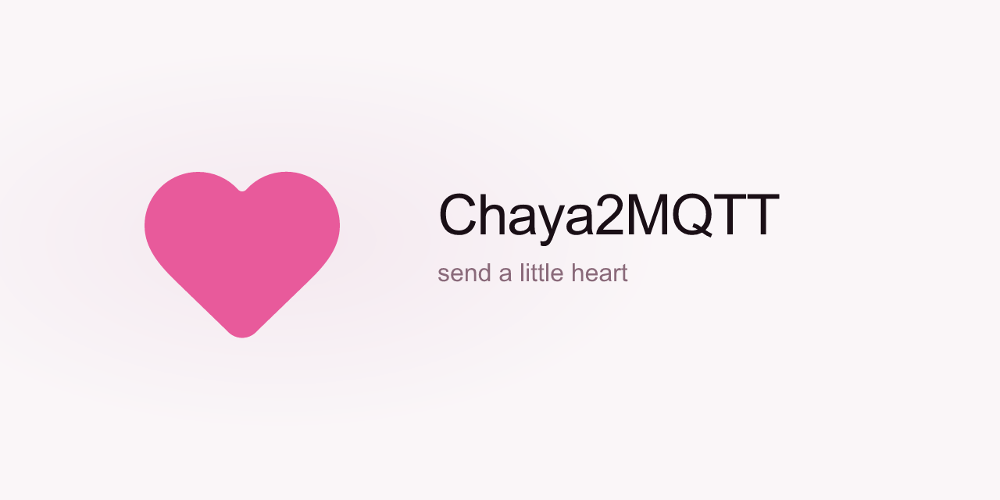

  

Send a little heart to someone special—no matter how far away they are.

Chaya2MQTT connects two [Waveshare ESP32-S3 e-paper displays](https://docs.waveshare.com/ESP32-S3-ePaper-1.54G):

Press the button on one and a red heart appears on the other.

Each display keeps track of the hearts you have sent and received, while MQTT quietly carries them between the two devices.

### What the display shows

**Online**

| Product title                                            | SoftAP setup                                      |
| -------------------------------------------------------- | ------------------------------------------------- |
|  |  |

| Offline                                                      | Power-off                                         |
| ------------------------------------------------------------ | ------------------------------------------------- |
|  |  |

## Bring your heart to life

Open the [web flasher](https://eyjunge1.github.io/chaya2mqtt/) in Chrome or Edge, connect USB-C, and install. Erase is on by default.

## License

[GNU GPL v3.0 only](LICENSE)