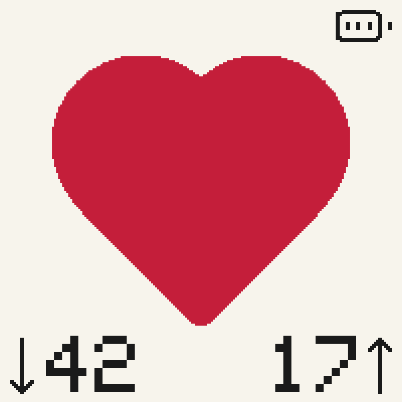
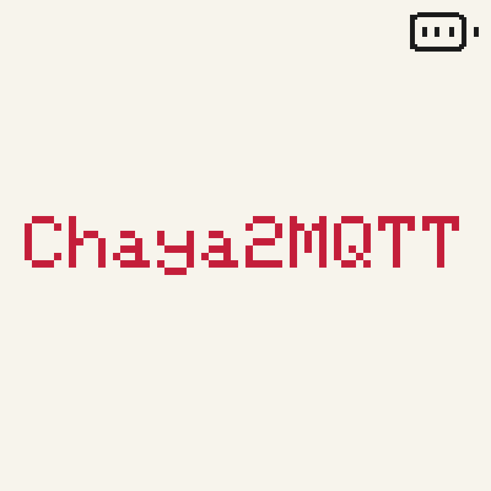

# Chaya2MQTT

Send a little heart to someone special—no matter how far away they are. ❤️

Chaya2MQTT connects two
[Waveshare ESP32-S3 e-paper displays](https://docs.waveshare.com/ESP32-S3-ePaper-1.54G):
press the button on one and a red heart appears on the other. Each display keeps
track of the hearts you have sent and received, while MQTT quietly carries them
between the two devices.

It is a tiny, always-there way to say *I'm thinking of you* without opening an app.

### What the display shows

Simulated 200×200 E-Ink views (same Lucide icons and layout as firmware):

| Online | Offline | SoftAP setup |
|:---:|:---:|:---:|
|  |  |  |

| Product title | Power-off |
|:---:|:---:|
|  |  |

More detail: [docs/DISPLAY.md](docs/DISPLAY.md). Regenerate the PNGs with `node scripts/render_display_previews.mjs`.

## Bring your heart to life

**Browser (recommended):** open the
[web flasher](https://eyjunge1.github.io/chaya2mqtt/) in Chrome or Edge, connect
USB-C (data cable), and install. Prefer erase on a first or recovery flash.

**PlatformIO:**

```bash
pio run -e esp32s3-release -t upload
```

Use `make upload` to keep saved settings, or `make upload-erase` for a factory-style
flash that erases them.

After flashing, the device opens the Wi-Fi network `Chaya2MQTT`. Scan the QR code
on its display and follow the setup page to connect it to Wi-Fi and its partner.

## Docs & license

Full setup, pairing, MQTT, and hardware notes: [docs/README.md](docs/README.md).

[GNU GPL v3.0 only](LICENSE) · [Contributing](CONTRIBUTING.md) ·
[Third-party notices](THIRD_PARTY_NOTICES.md)
