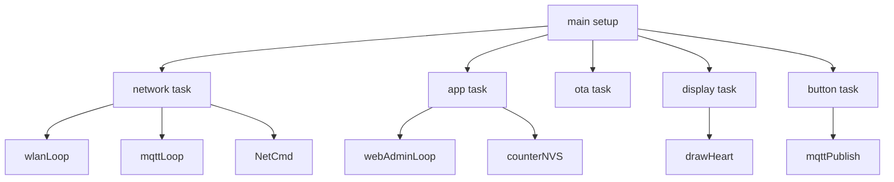
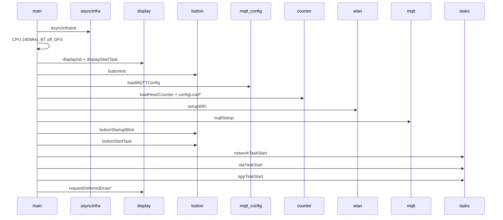
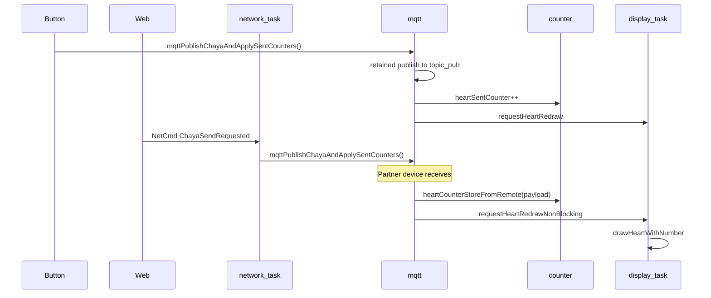

# Architecture

## Overview

Chaya2MQTT is **FreeRTOS multitasking firmware** for the ESP32. The traditional Arduino `loop()` is not used—`main.cpp` starts all tasks in `setup()` and immediately terminates `loop()` with `vTaskDelete(nullptr)`.

## FreeRTOS tasks

| Task | Stack | Priority | Core | File | Responsibility |
|------|-------|----------|------|------|----------------|
| **network** | 7168 | 5 | 1 | `network/network_task.cpp` | `wlanLoop()` (including recovery), `mqttLoop()`, `NetCmd` queue |
| **button** | 4096 | 8 | 1 | `hw/button_input.cpp`, `hw/button_led.cpp` | Debouncing, LED sequence, factory reset, MQTT sending |
| **app** | 4096 | 4 | 1 | `async/app_task.cpp` | `webAdminLoop()`, counter resets, NVS saves |
| **ota** | 8192 | 4 | 1 | `ota/ota_task.cpp` | `otaLoop()` (GitHub + Download) |
| **display** | 4096 | 3 | 1 | `display/display.cpp` | Exclusive SPI/EPD access |

**Task watchdog:** Network, app, OTA, and button are registered with the ESP task WDT. The **display task is intentionally excluded** because a full E-Ink refresh can take up to ~14 s.

## CPU & power

| Parameter | Value |
|-----------|-------|
| CPU clock (max) | **240 MHz** (`setCpuFrequencyMhz(240)`) |
| CPU clock (min, DFS) | 80 MHz |
| Light sleep | **Disabled** (`light_sleep_enable = false`) |
| Bluetooth | Off (`btStop()`, memory released) |
| WiFi power saving | Modem sleep when the MQTT session is active |

Light sleep is intentionally disabled so that web administration and MQTT reconnects remain responsive.

## Async infrastructure

At startup, `asyncInfraInit()` (in `async/task_handles.cpp`) creates:

### Queues

| Queue | Size | Element | Purpose |
|-------|------|---------|---------|
| `g_netCmdQueue` | 32 | `NetCmd` | Network commands (apply MQTT settings, reconnect, Chaya send) |
| `g_displayCmdQueue` | 32 | `DisplayMsg` | Display drawing commands |

### Mutexes

| Mutex | Purpose |
|-------|---------|
| `g_chayaPublishMutex` | Chaya publish path (button/web vs. MQTT) |
| `g_mqttClientMutex` | Allocate MQTT client / `esp_mqtt_*` |
| `g_heartDebounceMutex` | NVS persistence after a successful publish |
| `g_nvsMutex` | Thread-safe `Preferences`-Wrapper |
| `g_wifiTestMutex` | WiFi connection test (web vs. network) |
| `g_wifiApiMutex` | Arduino `WiFi` / `esp_wifi` API access |
| `s_mqttCfgMutex` | MQTT configuration (lazy initialization in `mqtt/config.cpp`) |

**Lock order** (never reverse it; documented in `mqtt/mqtt.h`):

1. `g_chayaPublishMutex`
2. `g_mqttClientMutex`
3. optional `g_heartDebounceMutex`

## Module overview

| Module | Path | Responsibility |
|--------|------|----------------|
| **MQTT configuration** | `src/mqtt/config.*` | Broker configuration (NVS `mqtt`), snapshot/pending API |
| **MQTT client** | `src/mqtt/mqtt_*.cpp` | `esp_mqtt_client`, TLS, publish/subscribe, reconnect |
| **Counter** | `src/heart/counter*.cpp` | Heart/sent counters, baselines, NVS `chaya` |
| **WiFi** | `src/wifi/wlan*.cpp` | STA/AP, captive DNS, mDNS, NTP, reconnect |
| **Network task** | `src/network/network_task.*` | Orchestrates WiFi + MQTT + NetCmd |
| **Display** | `src/display/*` | E-paper, dedicated drawing task |
| **Button** | `src/hw/button_*.cpp` | Button + LED, dedicated task |
| **Web admin** | `src/web/*` | HTTP routes, CSRF, SSE, SPA |
| **OTA** | `src/ota/*` | GitHub stable/beta check, HTTPUpdate + MD5, status/SSE |
| **App configuration** | `src/config/app_config.*` | Reset period |
| **TLS** | `src/tls/*` | Embedded CA bundle (MQTT + OTA) |
| **Diagnostics** | `src/diag/*` | Stack monitor, task WDT |

The filename **`wlan`** instead of `wifi` avoids a name collision with Arduino `<WiFi.h>`.

## Setup sequence

1. **Async infrastructure:** Create queues and mutexes (including the TLS CA bundle mutex)
2. **CPU:** 240 MHz, BT off, DFS (80–240 MHz, no light sleep; `CONFIG_PM_ENABLE`)
3. **Display:** Initialize hardware (`initial_full_refresh=false`) + start display task
4. **Button:** Initialize GPIO
5. **Serial:** 115200 in debug builds only (`CORE_DEBUG_LEVEL > 0`)
6. **Load NVS:** MQTT configuration, counters, reset period
7. **WiFi:** STA with stored credentials or `Chaya2MQTT` SoftAP + captive DNS
8. **MQTT:** Configure client (do not connect yet)
9. **Start tasks:** Button, network, OTA, app
10. **First drawing:** Heart (if a broker is configured) or splash screen (AP mode)
11. **OTA verification (deferred):** In the app task, only after 30 s of stable runtime since WiFi boot settlement (`ota_health.h` → `otaTryMarkValidAfterHealthCheck()`; no immediate marking in `setup()`)

## NetCmd – network command queue

The `NetCmd` enum (`async/event_types.h`) serializes network-related actions:

| Command | Trigger | Effect |
|---------|---------|--------|
| `MqttSettingsChanged` | Web POST `/api/mqtt` | Kill client, pending → active, save NVS, `mqttSetup`, delay connection by 3 s |
| `MqttKillClient` | Internal | `mqttDisconnect()` |
| `WifiReconnect` | `WiFi.onEvent` (disconnect / LOST_IP) | Soft reconnect, then forced reassociation (`disconnect+begin`) with backoff after the threshold |
| `ChayaSendRequested` | Web POST `/chaya-send` (the button directly uses `mqttPublishChayaAndApplySentCounters()`) | `mqttPublishChayaAndApplySentCounters()` |
| `FactoryResetRequested` | Hold button for 10 s | Network task calls `resetAllSettings()` (WDT-safe outside the button task) |

## DisplayMsg – display command queue

| Command | Effect |
|---------|--------|
| `DrawHeart` | `drawHeartWithNumber()` |
| `DrawSplash` | `drawSplashScreen()` |

Only the **display task** may access SPI/EPD directly. All other tasks use `requestDeferredDraw*()` or `requestHeartRedraw()`.

## Data flow: button press → display update

## Web admin: deferred work

HTTP handlers do not block for slow operations. Instead:

1. Set **atomics/flags** (`g_webAdminMqttApplyVersion.fetch_add(1)`, `g_webAdminRebootRequested`, etc.)
2. The **app task** (`webAdminLoop()`) processes flags every 500 ms
3. Network actions are placed in the queue as `NetCmd`

SSE events (`/events`) are also ticked in the app task (`webEventsTick()`).

## Counter logic: absolute vs. delta

| Concept | Storage location | Meaning |
|---------|------------------|---------|
| `heartCounter` | RAM + NVS | Received **absolute** value (from partner) |
| `heartSentCounter` | RAM + NVS | Successfully sent values |
| `counterBaseline` / `sentCountBaseline` | RAM + NVS | Basis for the **display delta** |
| Display | E-Ink | Shows `raw − baseline`, capped at 999 |

MQTT transports **absolute** counters; the display shows **deltas**. Details: [DISPLAY.md](DISPLAY.md).

## Persistence

All settings are stored in **NVS** (Non-Volatile Storage). There are four namespaces:

| Namespace | Content |
|-----------|---------|
| `wifi` | SSID/password |
| `mqtt` | Broker, topics, partner ID |
| `cfg` | Reset period, OTA check day, OTA channel |
| `chaya` | Counters, baselines |

Factory reset deletes all four. Details: [CONFIGURATION.md](CONFIGURATION.md).

## Further documentation

- Code reference: [MODULES.md](MODULES.md)
- MQTT protocol: [MQTT.md](MQTT.md)
- Web admin: [WEB_ADMIN.md](WEB_ADMIN.md)
- Hardware: [HARDWARE.md](HARDWARE.md)
