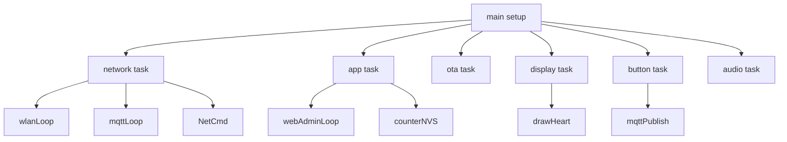
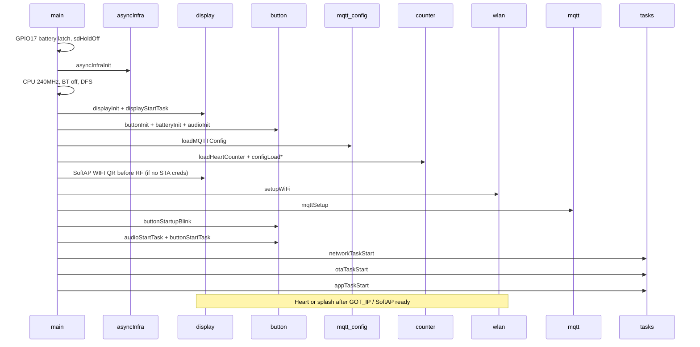
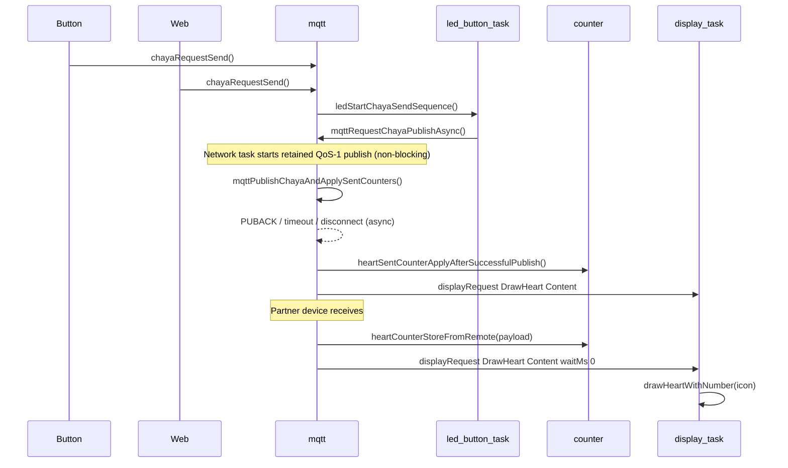

# Architecture

## Overview

Chaya2MQTT is **FreeRTOS multitasking firmware** for the **ESP32-S3** on the Waveshare 1.54G. The traditional Arduino `loop()` is not used—`main.cpp` starts all tasks in `setup()` and immediately terminates `loop()` with `vTaskDelete(nullptr)`.

## FreeRTOS tasks

| Task | Stack | Priority | Core | File | Responsibility |
|------|-------|----------|------|------|----------------|
| **network** | 7168 | 5 | 1 | `network/network_task.cpp` | `wlanLoop()` (including recovery), `mqttLoop()`, `NetCmd` queue |
| **button** | 4096 | 8 | 1 | `button/button_input.cpp`, `led/led.cpp` | BOOT debounce, LED patterns, MQTT send |
| **app** | 4096 | 4 | 1 | `async/app_task.cpp` | `webAdminLoop()`, OTA health, counter resets/NVS saves, battery poll |
| **ota** | 12288 | 4 | 1 | `ota/ota_task.cpp` | `otaLoop()` (GitHub + Download) |
| **display** | 8192 | 3 | 1 | `display/display_task.cpp` | Exclusive SPI/EPD access |
| **audio** | 6144 | 3 | 1 | `audio/audio.cpp` | ES8311 playback queue (mic stays off) |

**Task watchdog:** Network, app, audio, and button are registered with the ESP task WDT. OTA
temporarily unsubscribes while blocking network/flash work runs, then subscribes again while idle.
The **display task is intentionally excluded** because a full 1.54G refresh can take up to ~20 s.

All application tasks are pinned to core 1. Framework/network tasks use core 0 where configurable:

- AsyncTCP is explicitly pinned to core 0 (priority 10, queue 64, stack 16384 bytes).

This Core-1 pinning is **by design** until FreeRTOS runtime stats under EPD+MQTT+SSE load show starving of low-priority tasks (audit STAB-10). Do not move Display/Audio to core 0 without that measurement — AsyncTCP/WiFi already occupy core 0.
- WiFi/lwIP run in their ESP-IDF-managed contexts.
- `esp_mqtt_client` owns a separate task (priority 5, stack 10240 bytes); its core is left to ESP-IDF.
- WiFi event callbacks only update atomics and enqueue `NetCmd` work. WiFi, SNTP, mDNS, and
  display operations after `GOT_IP` run in the network task.

## CPU & power

| Parameter | Value |
|-----------|-------|
| CPU clock (max) | **240 MHz** (`setCpuFrequencyMhz(240)`) |
| CPU clock (min, DFS) | 80 MHz |
| Light sleep | **Disabled** (`light_sleep_enable = false`) |
| Bluetooth | Off (`btStop()`, memory released) |
| WiFi power saving | Modem sleep when the MQTT session is active |

Light sleep is intentionally disabled so that web administration and MQTT reconnects remain responsive.

## Async infrastructure

At startup, `asyncInfraInit()` (in `async/task_handles.cpp`) creates:

### Queues

| Queue | Size | Element | Purpose |
|-------|------|---------|---------|
| `g_netCmdQueue` | 32 | `NetCmd` | Network commands (apply MQTT settings, reconnect, Chaya send) |
| `g_displayCmdQueue` | 32 | `DisplayMsg` | Display drawing commands |
| `g_audioCmdQueue` | 4 | `AudioMsg` | TX/RX click (non-blocking) |

### Mutexes

| Mutex | Purpose |
|-------|---------|
| `g_chayaPublishMutex` | Chaya publish path (button/web vs. MQTT) |
| `g_mqttClientMutex` | Allocate MQTT client / `esp_mqtt_*` |
| `g_heartDebounceMutex` | NVS persistence after a successful publish |
| `g_nvsMutex` | Thread-safe `Preferences` wrapper |
| `g_wifiTestMutex` | WiFi connection test (web vs. network) |
| `g_wifiApiMutex` | Arduino `WiFi` / `esp_wifi` API access |
| `s_mqttCfgMutex` | MQTT configuration (lazy initialization in `mqtt/config.cpp`) |

**Lock order** (never reverse it; documented in `mqtt/mqtt.h`):

1. `g_chayaPublishMutex`
2. `g_mqttClientMutex`
3. optional `g_heartDebounceMutex`

Heart publishing retains one generation/message-ID-bound pending state. The network task only
*starts* the QoS-1 publish; PUBACK, disconnect abort, or a 5-second timeout (serviced in
`mqttLoop`) complete the async result. Counter/NVS/audio/display effects happen exactly once on
matching PUBACK. Native simulator cases cover ACK, late/absent ACK, disconnect, and competing
senders without requiring HIL in CI.

## Module overview

| Module | Path | Responsibility |
|--------|------|----------------|
| **MQTT configuration** | `src/mqtt/config.*` | Broker configuration (NVS `mqtt`), snapshot/pending API |
| **MQTT client** | `src/mqtt/mqtt_*.cpp` | `esp_mqtt_client`, TLS, publish/subscribe, reconnect |
| **Counter** | `src/heart/counter*.cpp` | Heart/sent counters, baselines, NVS `chaya` |
| **WiFi** | `src/wifi/wlan*.cpp` | STA/AP, captive DNS, mDNS, NTP, reconnect |
| **Network task** | `src/network/network_task.*` | Orchestrates WiFi + MQTT + NetCmd |
| **Display** | `src/display/*` | E-paper, dedicated drawing task |
| **Identity** | `src/identity/*` | Stable device ID + hostname |
| **Button** | `src/button/*` | BOOT (GPIO0), controlled PWR shutdown |
| **LED** | `src/led/*` | Header LED TX/pattern/refresh pulse |
| **Battery** | `src/battery/*` | GPIO4 ADC, percent, power latch + USB deep-sleep fallback |
| **HW** | `src/hw/*` | SD hold-off + board pin map |
| **Audio** | `src/audio/*` | ES8311 DAC click; capture disabled |
| **Web admin** | `src/web/*` | HTTP routes, CSRF, SSE, SPA |
| **OTA** | `src/ota/*` | GitHub stable/beta check, HTTPUpdate + SHA-256 sidecar, status/SSE |
| **App configuration** | `src/config/app_config.*` | Reset period, UI/LED/audio prefs; NVS utils/keys |
| **TLS** | `src/tls/*` | Embedded CA bundle (MQTT + OTA) |
| **Diagnostics** | `src/diag/*` | Stack monitor, task WDT |

The filename **`wlan`** instead of `wifi` avoids a name collision with Arduino `<WiFi.h>`.

## Setup sequence

1. **Power / SD:** Drive GPIO17 (`BAT_Control`) HIGH; hold microSD CLK/DAT0/CMD LOW (`sdHoldOff()`)
2. **Async infrastructure:** Create queues and mutexes (including the TLS CA bundle mutex)
3. **CPU:** 240 MHz, BT off, DFS (80–240 MHz, no light sleep; `CONFIG_PM_ENABLE`)
4. **Display:** Enable GPIO6, init SPI/EPD (`initial_full_refresh=true`) + start display task
5. **Button / battery / audio:** BOOT + PWR, ADC sample, ES8311 mic off
6. **Serial:** 115200 in debug builds only (`CORE_DEBUG_LEVEL > 0`)
7. **Load NVS:** MQTT configuration, counters, reset period, UI prefs, LED, audio, display view
8. **Pre-RF splash:** If no STA credentials, paint the SoftAP WIFI QR before bringing up Wi‑Fi RF
9. **WiFi:** STA with stored credentials or `Chaya2MQTT` SoftAP + captive DNS
10. **MQTT:** Configure client (do not connect yet)
11. **Start tasks:** Audio, button, network, OTA, app
12. **Operational drawing:** After STA `GOT_IP` (broker **and** partner → heart via `mqttCfgIsHeartReady()`; otherwise splash/waiting title) or when SoftAP setup finishes. Content heart redraws are no-ops until heart-ready. Applying MQTT settings that make the device heart-ready queues `DrawHeart` with `BootIfChanged`; broker-only (no partner) keeps/queues the waiting title splash.
13. **OTA verification (deferred):** In the app task, only after 30 s of stable runtime since WiFi boot settlement (`ota_health.h` → `otaTryMarkValidAfterHealthCheck()`; no immediate marking in `setup()`)

## NetCmd – network command queue

The `NetCmd` enum (`async/event_types.h`) serializes network-related actions:

| Command | Trigger | Effect |
|---------|---------|--------|
| `MqttSettingsChanged` | Web POST `/api/mqtt` | Kill client, pending → active, save NVS, `mqttSetup`, delay connection by 3 s, queue heart or waiting splash via `BootIfChanged` depending on `mqttCfgIsHeartReady()` |
| `MqttKillClient` | Internal | `mqttDisconnect()` |
| `WifiGotIp` | `WiFi.onEvent` (`GOT_IP`) | Finish STA boot, apply power/NTP/mDNS, and queue the operational screen in the network task |
| `WifiReconnect` | `WiFi.onEvent` (disconnect / LOST_IP) | Soft reconnect, then forced reassociation (`disconnect+begin`) with backoff after the threshold |
| `ChayaSendRequested` | Legacy/internal (web uses `chayaRequestSend()` directly) | `chayaRequestSend()` |
| `FactoryResetRequested` | Web POST `/api/factory-reset` | Network task calls `resetAllSettings()` outside the HTTP callback |

The network task services its queue and WiFi/MQTT loops every **50 ms in setup-AP mode** (for
responsive captive DNS) and every **250 ms in STA mode**. Queue traffic wakes it immediately.
`GOT_IP` and reconnect work are additionally coalesced in atomic flags, so neither is lost when the
queue is full. A stale reconnect is discarded when STA is already connected; mDNS re-validates the
link immediately before starting. During an E-Paper waveform, GOT_IP finalization, reconnect,
recovery, MQTT teardown, and MQTT settings apply remain pending; the network task resumes them
after the display task closes the low-interference window.

## DisplayMsg – display command queue

| Command | Effect |
|---------|--------|
| `DrawHeart` | `drawHeartWithNumber(icon)` |
| `DrawSplash` | `drawSplashScreen()` |
| `DrawPowerOff` | `drawPowerOffScreen()` |

Only the **display task** may access SPI/EPD directly. All other tasks use `displayRequest(cmd, mode, waitMs)`.

## Data flow: button press → display update

`chayaRequestSend()` returns `Unavailable` unless `mqttCfgIsHeartReady()` (broker **and** partner).
Content heart redraws are likewise no-ops until heart-ready; after unpair the display task
drops pending/queued heart paints so the waiting title stays.

## Web admin: deferred work

HTTP handlers do not block for slow operations. Instead:

1. Set **atomics/flags** (`g_webAdminMqttApplyVersion.fetch_add(1)`, `g_webAdminRebootRequested`, etc.)
2. The **app task** (`webAdminLoop()`) processes flags every 500 ms
3. Network actions are placed in the queue as `NetCmd`

SSE events (`/events`) are also ticked in the app task (`webEventsTick()`).

## Counter logic: absolute vs. delta

| Concept | Storage location | Meaning |
|---------|------------------|---------|
| `heartCounter` | RAM + NVS | Received **absolute** value (from partner) |
| `heartSentCounter` | RAM + NVS | Successfully sent values |
| `counterBaseline` / `sentCountBaseline` | RAM + NVS | Basis for the **display delta** |
| Display | E-Ink | Shows `raw − baseline`, capped at 999 |

MQTT transports **absolute** counters; the display shows **deltas**. Details: [DISPLAY.md](DISPLAY.md).

## Persistence

All settings are stored in **NVS** (Non-Volatile Storage). There are four namespaces:

| Namespace | Content |
|-----------|---------|
| `wifi` | Packed `cfg_v2` (SSID/password, DHCP/static, DNS, NTP), SoftAP PIN |
| `mqtt` | Broker, credentials, partner ID (topics derived in RAM only) |
| `cfg` | Reset period, UI/LED/audio prefs, OTA check day and channel |
| `chaya` | Counters; baselines in packed `baseBlob` |

Factory reset deletes all four. Details: [CONFIGURATION.md](CONFIGURATION.md).

## Further documentation

- Code reference: [MODULES.md](MODULES.md)
- MQTT protocol: [MQTT.md](MQTT.md)
- Web admin: [WEB_ADMIN.md](WEB_ADMIN.md)
- Hardware: [HARDWARE.md](HARDWARE.md)
