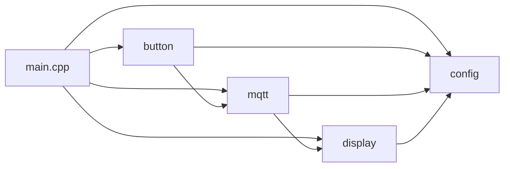
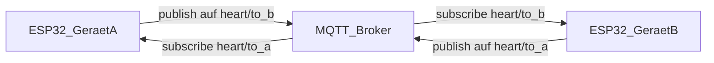
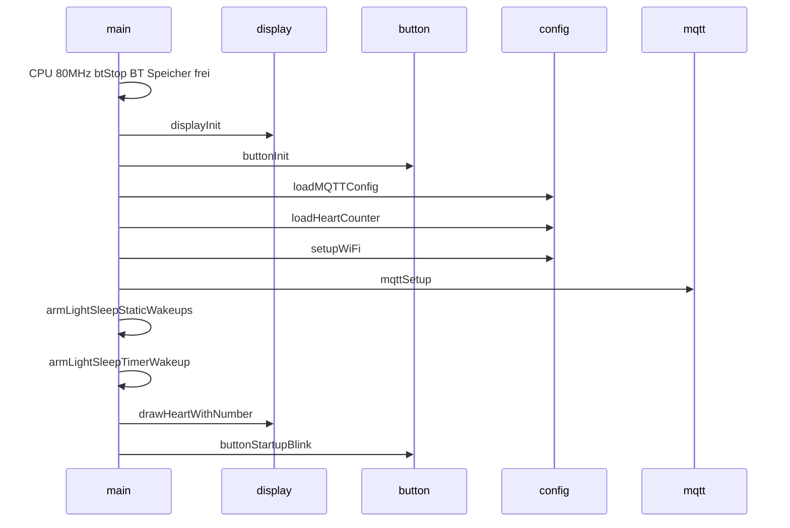
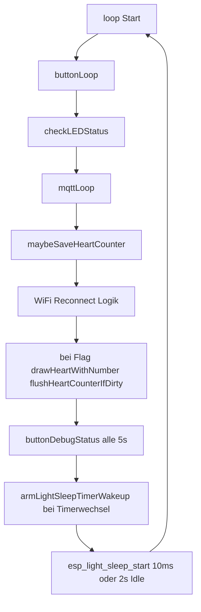

# Architektur

## Moduluebersicht

Die Firmware ist in **vier logische Module** plus `main.cpp` aufgeteilt:

| Modul | Dateien | Aufgabe |
|--------|---------|---------|
| **config** | `config.h`, `config.cpp` | MQTT/Herz-Zaehler in NVS, MycilaESPConnect (WLAN/Portal), Factory Reset |
| **web_admin** | `web_admin.h`, `web_admin.cpp` | HTTP `/mqtt` Wartungsseite (gemeinsamer `AsyncWebServer` mit ESPConnect) |
| **display** | `display.h`, `display.cpp` | GxEPD2-Initialisierung, Zeichnen Herz + Zahl |
| **mqtt** | `mqtt.h`, `mqtt.cpp` | TLS-Client, Broker-Verbindung, Subscribe/Publish, Callback erhoeht Counter |
| **button** | `button.h`, `button.cpp` | GPIO Taster + LED, Kurzdruck -> Publish, Langdruck -> Reset |

`main.cpp` **orchestriert** die Initialisierung und ruft in `loop()` die Modul-Loops auf.

## Abhaengigkeiten zwischen Modulen

- **mqtt** nutzt `mqtt_server`, `mqtt_port`, ... und `heartCounter` aus **config** und ruft **display** auf (`requestHeartRedraw` / indirekt Zeichnung).
- **display** liest `heartCounter` aus **config** fuer die Zahlendarstellung.
- **button** nutzt **config** (Reset) und **mqtt** (`mqttPublishHeart()`).

## Kommunikation: zwei Geraete ueber MQTT

Jedes Geraet hat **zwei getrennte Topics** -- ein **Sende-Topic** (`mqtt_topic_pub`) und ein **Empfangs-Topic** (`mqtt_topic_sub`). Diese werden im Captive Portal konfiguriert und **gekreuzt** eingerichtet:

- Geraet A publisht auf `heart/to_b`, subscribt auf `heart/to_a`
- Geraet B publisht auf `heart/to_a`, subscribt auf `heart/to_b`

Dadurch empfaengt jedes Geraet **nur die Nachrichten vom anderen** -- der eigene Knopfdruck erhoeht nicht den eigenen Counter.

Beim **Empfang** einer Nachricht auf dem Empfangs-Topic wird der lokale `heartCounter` nur erhoeht, wenn der Payload exakt **`heart`** ist (5 Bytes); sonst wird die Nachricht ignoriert. Anschliessend wird das Herz-Display neu gezeichnet.

- **Transport:** `WiFiClientSecure` + `PubSubClient`
- **TLS:** In `mqtt.cpp`: `WiFiClientSecure::setCACertBundle()` mit dem eingebauten Mozilla-CA-Bundle aus `libmbedtls.a` (ESP-IDF `CONFIG_MBEDTLS_CERTIFICATE_BUNDLE`)
- **Standard-Port in Konfiguration:** 8883

## Setup-Ablauf (`setup()`)

1. CPU **80 MHz** (Build-Flag `board_build.f_cpu` in `platformio.ini`); **Bluetooth aus:** `btStop()` und `esp_bt_controller_mem_release()` (weniger RAM/Strom)
2. **Serial** 115200 nur wenn `CORE_DEBUG_LEVEL > 0` (Debug-Build)
3. Display hardware initialisieren
4. Button/LED-Pins
5. Gespeicherte MQTT-Parameter laden; Zaehler aus NVS (`loadHeartCounter`)
6. WiFi (ggf. Captive Portal) + Speichern der Portal-Parameter; bei **identischem** Sende- und Empfangs-Topic werden Defaults `heart/to_b` / `heart/to_a` gespeichert (kein Selbstempfang). Danach **WiFi Modem Sleep** (`WiFi.setSleep(true)`), **`esp_wifi_set_ps(WIFI_PS_MAX_MODEM)`** und **HT20** (`esp_wifi_set_bandwidth(WIFI_IF_STA, WIFI_BW_HT20)`)
7. MQTT-Client konfigurieren (Server, Callback, TLS mit CA-Bundle)
8. **Light-Sleep-Wakeup:** `armLightSleepStaticWakeups()` (GPIO Taster, WiFi), danach `armLightSleepTimerWakeup()` (adaptiver Timer)
9. Erste Zeichnung mit `heartCounter` (Start: 0); nach Refresh **Display Hibernate** (Controller Deep Sleep)
10. LED-Startsequenz (3x Blink)

## Hauptschleife (`loop()`)

- **mqttLoop:** Bei Verbindungsverlust **nicht-blockierender** Reconnect (ein Versuch pro Abstand, exponentieller Backoff 5 s bis max. 60 s bei Connect-Fehlern; leerer Server / kein WLAN: feste Intervalle)
- **WiFi:** bei Verlust Reconnect (max. alle **30 s**, sofort beim ersten Verlust); nach **3** fehlgeschlagenen Versuchen `disconnect`, nach **>= 100 ms** (naechste Loop-Iterationen) `WiFi.begin()` ohne blockierendes `delay(100)`
- **Display:** nach MQTT-Empfang nur Flag; `drawHeartWithNumber()` laeuft in `loop()` wenn `consumeHeartRedraw()`; danach `flushHeartCounterIfDirty()` (Zaehler sofort in NVS); zusaetzlich `maybeSaveHeartCounter()` als Safety-Net (~30 s)
- **Light-Sleep:** Timer **10 ms**, wenn `buttonIsLedTxSequenceActive()` (LED-Sequenz), sonst **2 s**; Wakeup-Quellen: **Timer**, **GPIO** (Taster HIGH), **WiFi** (`esp_sleep_enable_wifi_wakeup`)
- **Debug:** alle 5 s Button-/LED-Zustand auf Serial

## MQTT-Protokoll (praktisch)

| Aspekt | Wert |
|--------|------|
| Sende-Topic | Konfigurierbar, Default `heart/to_b` |
| Empfangs-Topic | Konfigurierbar, Default `heart/to_a` |
| Publish (Knopf) | Payload = **`heart`** auf Sende-Topic (`mqttPublishHeart()`) |
| Subscribe | Empfangs-Topic mit **QoS 1** |
| Callback | Nur Payload `heart` -> `heartCounter++`, `requestHeartRedraw()`; Zeichnung in `loop()`; nach Redraw `flushHeartCounterIfDirty()`; zusaetzlich `maybeSaveHeartCounter()` (~30 s) |
| LWT | Topic = Sende-Topic + **`/lwt`**, Payload **`offline`**, QoS 1, retain; nach Connect retained **`online`** auf dasselbe Topic |

Authentifizierung: optional ueber `mqtt_username` / `mqtt_password` aus dem Portal.

## Persistenz

- **WiFi:** WiFiManager speichert Zugangsdaten intern.
- **MQTT:** Namespace `mqtt` in `Preferences` (`server`, `port`, `user`, `pass`, `topic_pub`, `topic_sub`).
- **Zaehler:** Namespace `heart`, Key `counter` (wird bei MQTT-Empfang aktualisiert; Factory Reset **loescht den Zaehler nicht**).

Siehe [MODULES.md](MODULES.md) fuer Funktionsdetails.
