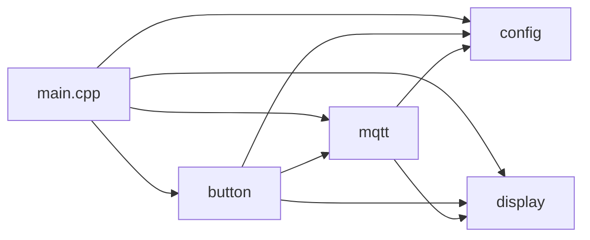
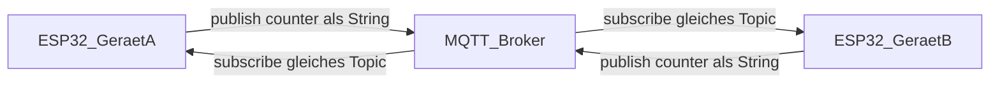
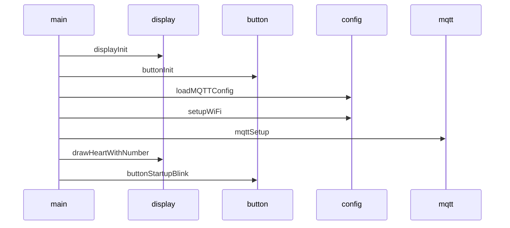
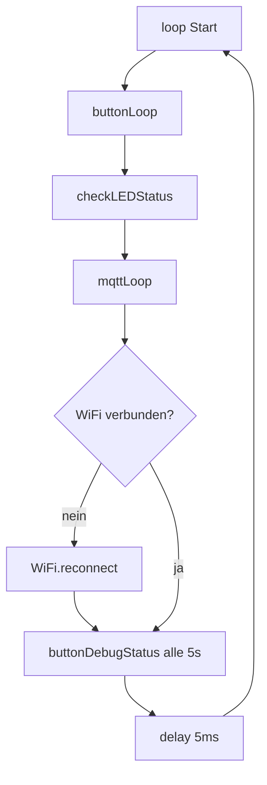

# Architektur

## Modulübersicht

Die Firmware ist in **vier logische Module** plus `main.cpp` aufgeteilt:

| Modul | Dateien | Aufgabe |
|--------|---------|---------|
| **config** | `config.h`, `config.cpp` | MQTT-Werte aus NVS (`Preferences`), WiFiManager-Captive-Portal, Factory Reset |
| **display** | `display.h`, `display.cpp` | GxEPD2-Initialisierung, globale Variable `counter`, Zeichnen Herz + Zahl |
| **mqtt** | `mqtt.h`, `mqtt.cpp` | TLS-Client, Broker-Verbindung, Subscribe/Publish, Callback erhöht Counter |
| **button** | `button.h`, `button.cpp` | GPIO Taster + LED, Kurzdruck → Publish, Langdruck → Reset |

`main.cpp` **orchestriert** die Initialisierung und ruft in `loop()` die Modul-Loops auf.

## Abhängigkeiten zwischen Modulen

- **mqtt** nutzt `mqtt_server`, `mqtt_port`, … aus **config** und ruft **display** auf (`drawHeartWithNumber`).
- **button** nutzt **config** (Reset), **mqtt** (`client`, Topic), **display** (`counter` für den Payload).

## Kommunikation: zwei Geräte über MQTT

Beide ESP32 verbinden sich mit dem **gleichen Broker** und abonnieren **dasselbe Topic**. Beim **Kurzdruck** publiziert das Gerät den **aktuellen** `counter` als String. Beim **Empfang** einer beliebigen Nachricht auf dem Topic wird der **lokale** `counter` **um 1 erhöht** (Inhalt der Nachricht wird für die Zählerlogik nicht ausgewertet).

**Wichtig:** Da jeder Empfang `counter++` auslöst, erhöhen sich die Zähler bei jedem empfangenen Event – das ist die gewünschte Kopplung „Knopf auf dem einen → Anzeige auf dem anderen“ (und ggf. auch Reflexion auf dem sendenden Gerät, wenn der Broker die eigene Nachricht zurückspiegelt – je nach Broker-Konfiguration).

- **Transport:** `WiFiClientSecure` + `PubSubClient`
- **TLS:** `espClient.setInsecure()` – keine Server-Zertifikatsvalidierung
- **Standard-Port in Konfiguration:** 8883

## Setup-Ablauf (`setup()`)

1. Serial 115200
2. Display hardware initialisieren
3. Button/LED-Pins
4. Gespeicherte MQTT-Parameter laden
5. WiFi (ggf. Captive Portal) + Speichern der Portal-Parameter
6. MQTT-Client konfigurieren (Server, Callback)
7. Erste Zeichnung mit `counter` (Start: 0)
8. LED-Startsequenz (3× Blink)

## Hauptschleife (`loop()`)

- **mqttLoop:** Bei Verbindungsverlust blockierender Reconnect (`mqttReconnect`)
- **WiFi:** bei Verlust `WiFi.reconnect()`
- **Debug:** alle 5 s Button-/LED-Zustand auf Serial

## MQTT-Protokoll (praktisch)

| Aspekt | Wert |
|--------|------|
| Topic | Konfigurierbar, Default `esp32/heart_counter` |
| Publish (Knopf) | Payload = `String(counter)` (ASCII-Ziffern) |
| Subscribe | Gleiches Topic wie Publish |
| Callback | Jede empfangene Nachricht → `counter++`, `drawHeartWithNumber()` |

Authentifizierung: optional über `mqtt_username` / `mqtt_password` aus dem Portal.

## Persistenz

- **WiFi:** WiFiManager speichert Zugangsdaten intern.
- **MQTT:** Namespace `mqtt` in `Preferences` (`server`, `port`, `user`, `pass`, `topic`).

Siehe [MODULES.md](MODULES.md) für Funktionsdetails.
