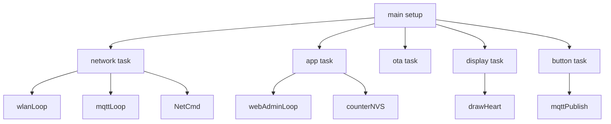
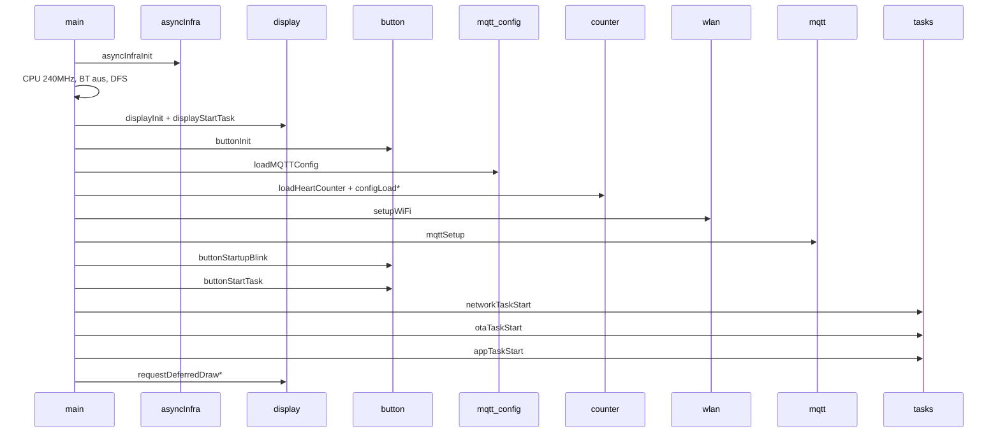
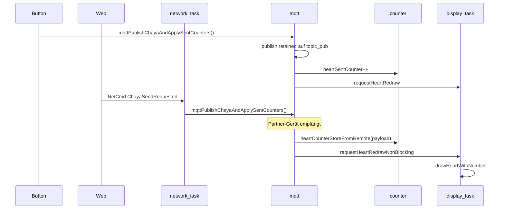

# Architektur

## Überblick

Chaya2MQTT ist eine **FreeRTOS-Multi-Task-Firmware** für den ESP32. Die klassische Arduino-`loop()`-Schleife wird nicht genutzt – `main.cpp` startet in `setup()` alle Tasks und beendet `loop()` sofort mit `vTaskDelete(nullptr)`.

## FreeRTOS-Tasks

| Task | Stack | Priorität | Core | Datei | Aufgabe |
|------|-------|-----------|------|-------|---------|
| **network** | 7168 | 5 | 1 | `network/network_task.cpp` | `wlanLoop()`, `mqttLoop()`, `NetCmd`-Queue |
| **button** | 4096 | 8 | 1 | `hw/button_input.cpp`, `hw/button_led.cpp` | Debounce, LED-Sequenz, Factory Reset, MQTT-Senden |
| **app** | 4096 | 4 | 1 | `async/app_task.cpp` | `webAdminLoop()`, Counter-Resets, NVS-Saves |
| **ota** | 8192 | 4 | 1 | `ota/ota_task.cpp` | `otaLoop()` (GitHub + Download) |
| **display** | 4096 | 3 | 1 | `display/display.cpp` | Exklusiver SPI/EPD-Zugriff |

**Task-Watchdog:** Network, App, OTA und Button sind beim ESP Task-WDT angemeldet. Der **Display-Task ist absichtlich ausgenommen**, da ein E-Ink-Full-Refresh bis zu ~14 s dauern kann.

## CPU & Energie

| Parameter | Wert |
|-----------|------|
| CPU-Takt (max) | **240 MHz** (`setCpuFrequencyMhz(240)`) |
| CPU-Takt (min, DFS) | 80 MHz |
| Light-Sleep | **deaktiviert** (`light_sleep_enable = false`) |
| Bluetooth | aus (`btStop()`, Speicher freigegeben) |
| WiFi Power Save | Modem-Sleep wenn MQTT-Session aktiv |

Light-Sleep wurde bewusst deaktiviert, damit Web-Admin und MQTT-Reconnects responsiv bleiben.

## Async-Infrastruktur

`asyncInfraInit()` (in `async/task_handles.cpp`) legt beim Start an:

### Queues

| Queue | Größe | Element | Zweck |
|-------|-------|---------|-------|
| `g_netCmdQueue` | 32 | `NetCmd` | Netzwerk-Befehle (MQTT-Apply, Reconnect, Chaya-Send) |
| `g_displayCmdQueue` | 32 | `DisplayMsg` | Display-Zeichnungsbefehle |

### Mutexe

| Mutex | Zweck |
|-------|-------|
| `g_chayaPublishMutex` | Chaya-Publish-Pfad (Button/Web vs. MQTT) |
| `g_mqttClientMutex` | MQTT-Client allozieren / `esp_mqtt_*` |
| `g_heartDebounceMutex` | NVS-Persistenz nach erfolgreichem Publish |
| `g_nvsMutex` | Thread-safe `Preferences`-Wrapper |
| `g_wifiTestMutex` | WiFi-Verbindungstest (Web vs. Network) |
| `g_wifiApiMutex` | Arduino `WiFi` / `esp_wifi` API-Zugriff |
| `s_mqttCfgMutex` | MQTT-Konfiguration (lazy-init in `mqtt/config.cpp`) |

**Lock-Reihenfolge** (niemals umkehren, dokumentiert in `mqtt/mqtt.h`):

1. `g_chayaPublishMutex`
2. `g_mqttClientMutex`
3. optional `g_heartDebounceMutex`

## Modulübersicht

| Modul | Pfad | Aufgabe |
|-------|------|---------|
| **MQTT-Config** | `src/mqtt/config.*` | Broker-Konfiguration (NVS `mqtt`), Snapshot/Pending-API |
| **MQTT-Client** | `src/mqtt/mqtt_*.cpp` | `esp_mqtt_client`, TLS, Publish/Subscribe, Reconnect |
| **Counter** | `src/heart/counter*.cpp` | Herz-/Sent-Zähler, Baselines, NVS `chaya` |
| **WLAN** | `src/wifi/wlan*.cpp` | STA/AP, Captive DNS, mDNS, NTP, Reconnect |
| **Network-Task** | `src/network/network_task.*` | Orchestriert WLAN + MQTT + NetCmd |
| **Display** | `src/display/*` | E-Paper, eigener Drawing-Task |
| **Button** | `src/hw/button_*.cpp` | Taster + LED, eigener Task |
| **Web-Admin** | `src/web/*` | HTTP-Routen, Auth, SSE, HTML |
| **OTA** | `src/ota/*` | GitHub-Release-Check, Flash-Install |
| **App-Config** | `src/config/app_config.*` | Reset-Periode, Web-Auth-Flag |
| **TLS** | `src/tls/*` | Eingebettetes CA-Bundle (MQTT + OTA) |
| **Diag** | `src/diag/*` | Stack-Monitor, Task-WDT |

Dateiname **`wlan`** statt `wifi` vermeidet Namenskollision mit Arduino `<WiFi.h>`.

## Setup-Ablauf

1. **Async-Infra:** Queues und Mutexe anlegen (inkl. TLS-CA-Bundle-Mutex)
2. **CPU:** 240 MHz, BT aus, DFS (80–240 MHz, kein Light-Sleep; `CONFIG_PM_ENABLE`)
3. **Display:** Hardware-Init (`initial_full_refresh=false`) + Display-Task starten
4. **Button:** GPIO initialisieren
5. **Serial:** 115200 nur im Debug-Build (`CORE_DEBUG_LEVEL > 0`)
6. **NVS laden:** MQTT-Config, Zähler, Reset-Periode, Web-Auth
7. **WiFi:** STA mit gespeicherten Credentials oder SoftAP `Chaya2MQTT` + Captive DNS
8. **MQTT:** Client konfigurieren (noch nicht verbinden)
9. **Tasks starten:** Button, Network, OTA, App
10. **Erste Zeichnung:** Herz (wenn Broker konfiguriert) oder Splash (AP-Modus)
11. **OTA-Verify (deferred):** `otaTryMarkValidAfterHealthCheck()` im App-Task nach Health-Checks (kein sofortiges Markieren in `setup()`)

## NetCmd – Netzwerk-Befehlsqueue

Die `NetCmd`-Enum (`async/event_types.h`) serialisiert netzwerkrelevante Aktionen:

| Befehl | Auslöser | Wirkung |
|--------|---------|---------|
| `MqttSettingsChanged` | Web POST `/mqtt` oder `/pairing` | Client kill, Pending→Active, NVS save, `mqttSetup`, Connect +3 s verzögert |
| `MqttKillClient` | Intern | `mqttDisconnect()` |
| `WifiReconnect` | `WiFi.onEvent` (Disconnect) | STA-Reconnect mit Backoff |
| `ChayaSendRequested` | Web POST `/chaya-send` (Button nutzt direkt `mqttPublishChayaAndApplySentCounters()`) | `mqttPublishChayaAndApplySentCounters()` |
| `FactoryResetRequested` | Button 10 s halten | Network-Task ruft `resetAllSettings()` (WDT-sicher außerhalb Button-Task) |

## DisplayMsg – Display-Befehlsqueue

| Befehl | Wirkung |
|--------|---------|
| `DrawHeart` | `drawHeartWithNumber()` |
| `DrawSplash` | `drawSplashScreen()` |
| `DrawAuthCode` | 6-stelliger Login-Code auf E-Ink |
| `DrawAuthPrompt` | „Web Auth?" auf E-Ink |

Nur der **Display-Task** darf SPI/EPD direkt ansprechen. Alle anderen Tasks nutzen `requestDeferredDraw*()` oder `requestHeartRedraw()`.

## Datenfluss: Knopfdruck → Display-Update

## Web-Admin: Deferred Work

HTTP-Handler blockieren nicht für langsame Operationen. Stattdessen:

1. **Atomics/Flags** setzen (`g_webAdminMqttApplyVersion.fetch_add(1)`, `g_webAdminRebootRequested`, …)
2. **App-Task** (`webAdminLoop()`) verarbeitet Flags alle 500 ms
3. Netzwerk-Aktionen werden als `NetCmd` in die Queue gestellt

SSE-Events (`/events`) werden ebenfalls im App-Task getickt (`webEventsTick()`).

## Zähler-Logik: Absolut vs. Delta

| Konzept | Speicherort | Bedeutung |
|---------|-------------|-----------|
| `heartCounter` | RAM + NVS | Empfangener **absoluter** Stand (vom Partner) |
| `heartSentCounter` | RAM + NVS | Erfolgreich gesendete Werte |
| `counterBaseline` / `sentCountBaseline` | RAM + NVS | Basis für **Anzeige-Delta** |
| Display | E-Ink | Zeigt `raw − baseline`, gecappt bei 999 |

MQTT transportiert **absolute** Zähler; das Display zeigt **Deltas**. Details: [DISPLAY.md](DISPLAY.md).

## Persistenz

Alle Einstellungen liegen in der **NVS** (Non-Volatile Storage). Vier Namespaces:

| Namespace | Inhalt |
|-----------|--------|
| `wifi` | SSID/Passwort |
| `mqtt` | Broker, Topics, Partner-ID |
| `cfg` | Reset-Periode, Web-Auth, OTA-Check-Tag |
| `chaya` | Zähler, Baselines |

Factory Reset löscht alle vier. Details: [CONFIGURATION.md](CONFIGURATION.md).

## Weitere Dokumentation

- Code-Referenz: [MODULES.md](MODULES.md)
- MQTT-Protokoll: [MQTT.md](MQTT.md)
- Web-Admin: [WEB_ADMIN.md](WEB_ADMIN.md)
- Hardware: [HARDWARE.md](HARDWARE.md)
