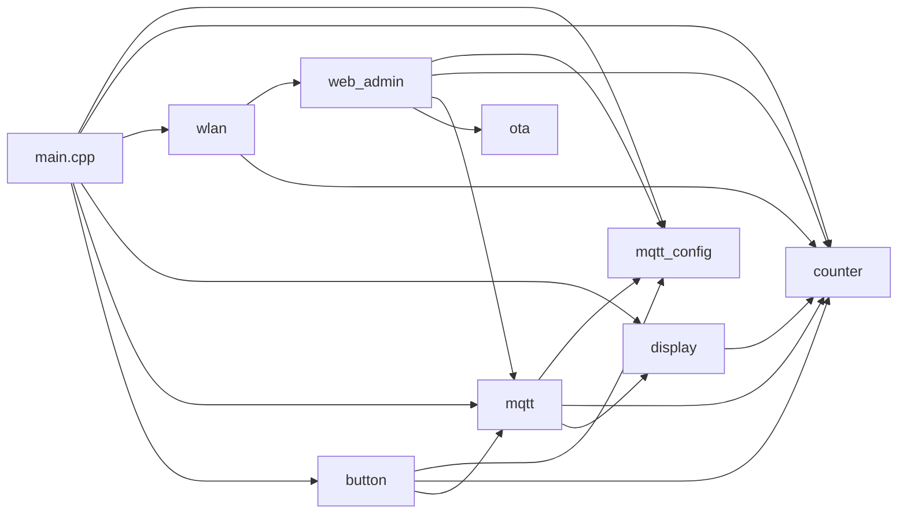
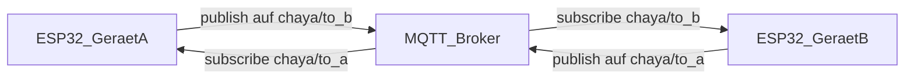
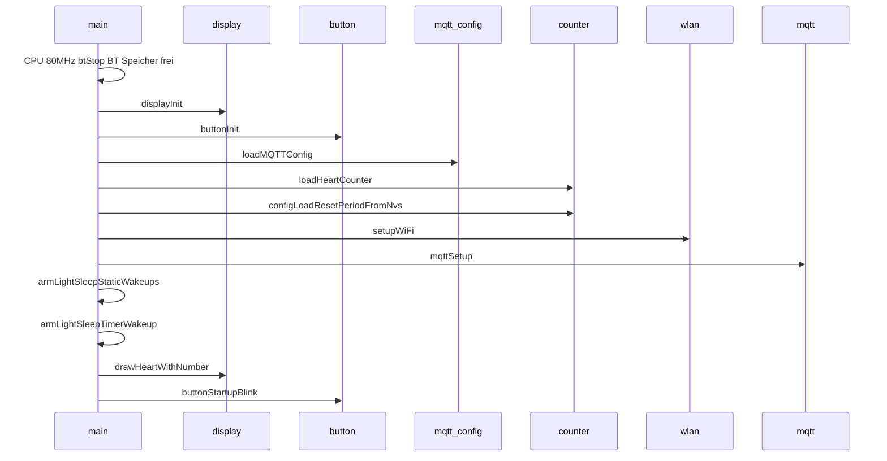
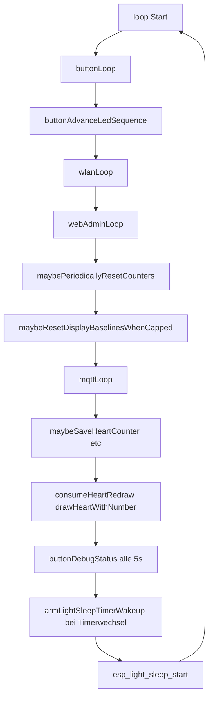

# Architektur

## Moduluebersicht

Die Firmware ist in **mehrere fokussierte Module** plus `main.cpp` aufgeteilt:

| Modul | Dateien | Aufgabe |
|--------|---------|---------|
| **mqtt_config** | `mqtt_config.h`, `mqtt_config.cpp`, `constants.h` | MQTT-Brokereinstellungen (NVS Namespace `mqtt`), gemeinsame Konstanten |
| **counter** | `counter.h`, `counter.cpp` | Herz-Zähler / Sent-Zähler, Baselines, periodischer Display-Reset (NVS `chaya`, `cfg`) |
| **wlan** | `wlan.h`, `wlan.cpp`, `pins.h` | STA/AP, Captive DNS, mDNS, NTP, Reconnect-Backoff; registriert `AsyncWebServer`-Routen; Factory Reset |
| **web_admin** | `web_admin.h`, `web_admin.cpp` | HTTP-Routen und Formular-Handler (Dashboard, Wi‑Fi, MQTT, Settings); `webAdminLoop()` |
| **ota** | `ota.h`, `ota.cpp` | GitHub-Versionscheck, täglicher Auto-Check (NVS), Firmware-Download (`HTTPUpdate`) |
| **web_pages** | `web_pages.h`, `web_pages.cpp` | HTML-Antworten (Streaming), eingebettetes CSS über `web_styles.h` |
| **display** | `display.h`, `display.cpp` | GxEPD2-Initialisierung, Zeichnen Herz + Zähler-Deltas |
| **mqtt** | `mqtt.h`, `mqtt.cpp` | TLS-Client, Broker-Verbindung, Subscribe/Publish, Callback setzt `heartCounter` |
| **button** | `button.h`, `button.cpp` | GPIO Taster + LED, Kurzdruck → Publish, Langdruck → Factory Reset |

`wlan.cpp` heisst **wlan** (nicht `wifi.*`), damit `#include <WiFi.h>` (Arduino) auf **case-insensitiven** Dateisystemen nicht mit einem Projekt-Header kollidiert.

`main.cpp` **orchestriert** die Initialisierung und ruft in `loop()` die Modul-Loops auf.

## Abhaengigkeiten zwischen Modulen

- **mqtt** nutzt `mqttCfg` aus **mqtt_config**, `heartCounter` aus **counter**, ruft **display** auf (`requestHeartRedraw`).
- **display** liest Zähler und Baselines aus **counter** fuer die Darstellung.
- **button** nutzt **wlan** (`resetAllSettings`, `configIsApMode`), **counter**, **mqtt** (`mqttPublishChaya()`).
- **wlan** registriert Routen fuer **web_admin**; **main** ruft `wlanLoop()`, `webAdminLoop()` und bei STA `maybePeriodicallyResetCounters()` sowie `maybeResetDisplayBaselinesWhenCapped()` (**counter**).
- **web_admin** ruft **ota** (`otaLoop`) fuer Updates.

## Kommunikation: zwei Geraete ueber MQTT

Jedes Geraet hat **zwei getrennte Topics** -- ein **Sende-Topic** (`mqtt_topic_pub`) und ein **Empfangs-Topic** (`mqtt_topic_sub`). Diese werden im Captive Portal konfiguriert und **gekreuzt** eingerichtet:

- Geraet A publisht auf `chaya/to_b`, subscribt auf `chaya/to_a`
- Geraet B publisht auf `chaya/to_a`, subscribt auf `chaya/to_b`

Dadurch empfaengt jedes Geraet **nur die Nachrichten vom anderen** -- der eigene Knopfdruck erhoeht nicht den eigenen Counter.

Beim **Empfang** einer Nachricht auf dem Empfangs-Topic wird der Payload als Dezimalzahl geparst und `heartCounter` direkt auf diesen Wert **gesetzt** (kein `++`). Ungueltige Payloads (keine ganze Zahl, Laenge > 10) werden ignoriert. Anschliessend wird das Herz-Display neu gezeichnet, sofern sich der Wert geaendert hat.

Da Nachrichten als **retained** publiziert werden, liefert der Broker beim Reconnect automatisch den letzten Zaehlerstand -- Nachrichten, die waehrend einer Offline-Phase verpasst wurden, gehen nicht verloren.

- **Transport:** `WiFiClientSecure` + `PubSubClient`
- **TLS:** In `mqtt.cpp`: `WiFiClientSecure::setCACertBundle()` mit dem eingebauten Mozilla-CA-Bundle aus `libmbedtls.a` (ESP-IDF `CONFIG_MBEDTLS_CERTIFICATE_BUNDLE`)
- **Standard-Port in Konfiguration:** 8883

## Setup-Ablauf (`setup()`)

1. CPU **80 MHz** (Build-Flag `board_build.f_cpu` in `platformio.ini`); **Bluetooth aus:** `btStop()` und `esp_bt_controller_mem_release()` (weniger RAM/Strom)
2. **Serial** 115200 nur wenn `CORE_DEBUG_LEVEL > 0` (Debug-Build)
3. Display hardware initialisieren
4. Button/LED-Pins
5. Gespeicherte MQTT-Parameter laden; Zaehler aus NVS (`loadHeartCounter`); Reset-Periode cachen (`configLoadResetPeriodFromNvs`)
6. WiFi ueber `setupWiFi()` (**wlan**): STA mit gespeicherten Credentials oder SoftAP **`Chaya2MQTT`** mit Captive DNS (`DNSServer`), gemeinsamer **`AsyncWebServer`** (Port 80). Nach STA-Verbindung: **WiFi Modem Sleep** (`WiFi.setSleep(true)`), **`esp_wifi_set_ps(WIFI_PS_MIN_MODEM)`**, **HT20**. Reconnect bei Disconnect ueber `WiFi.onEvent` mit exponentiellem Backoff.
7. MQTT-Client konfigurieren (Server, Callback, TLS mit CA-Bundle)
8. **Light-Sleep-Wakeup:** `armLightSleepStaticWakeups()` (GPIO Taster, WiFi), danach `armLightSleepTimerWakeup()` (adaptiver Timer)
9. Erste Zeichnung mit `heartCounter` (Start: 0); nach Refresh **Display Hibernate** (Controller Deep Sleep)
10. LED-Startsequenz (3x Blink)

## Hauptschleife (`loop()`)

- **mqttLoop:** nicht-blockierender Reconnect mit Backoff (siehe `mqtt.cpp`).
- **wlanLoop:** Captive DNS im AP, mDNS-Restart nach GOT_IP.
- **webAdminLoop:** MQTT-Anwendung aus Formular, Reboot/Wi-Fi-Reconnect, **`otaLoop()`**.
- **maybePeriodicallyResetCounters:** periodischer Zähler-Baseline-Roll (**counter**, nur wenn nicht AP, Intervall 0 = aus).
- **maybeResetDisplayBaselinesWhenCapped:** wenn Anzeige-Delta einer Seite >= 999, Baseline-Roll fuer diese Seite (**counter**, nur wenn nicht AP).
- **WiFi-Reconnect:** Event-gesteuert in **wlan** (`WiFi.reconnect()` mit Backoff), nicht in `main`.

## MQTT-Protokoll (praktisch)

| Aspekt | Wert |
|--------|------|
| Sende-Topic | Konfigurierbar, Default `chaya/to_b` |
| Empfangs-Topic | Konfigurierbar, Default `chaya/to_a` |
| Publish (Knopf) | Payload = `heartSentCounter + 1` als Dezimalstring, **retained**, auf Sende-Topic (`mqttPublishChaya()`) |
| Subscribe | Empfangs-Topic mit **QoS 1**; Broker liefert beim Reconnect automatisch letzten retained Zaehlerstand |
| Callback | Dezimalstring parsen -> `heartCounter` **setzen** (nicht inkrementieren); `requestHeartRedraw()` nur bei Aenderung; Zeichnung in `loop()`; nach Redraw `flushHeartCounterIfDirty()`; zusaetzlich `maybeSaveHeartCounter()` (~30 s) |
| LWT | Topic = Sende-Topic + **`/lwt`**, Payload **`offline`**, QoS 1, retain; nach Connect retained **`online`** auf dasselbe Topic |

Authentifizierung: optional ueber `mqtt_username` / `mqtt_password` aus dem Portal.

## Persistenz

- **WiFi:** Namespace `wifi` in `Preferences` (`ssid`, `pass`), geschrieben ueber Web-Formular `/wifi-connect` (`configSaveWiFiCredentials`).
- **MQTT:** Namespace `mqtt` (`server`, `port`, `user`, `pass`, `topic_pub`, `topic_sub`).
- **Anzeige-Reset-Periode:** Namespace `cfg`, Key `rstPeriod` (0 = periodisch aus; 1–30 = UTC-Tage; Default wenn fehlend 7). Zusaetzlich: Anzeige je Seite auf 0 wenn Delta >= 999.
- **OTA-Letzter Check-Tag:** Namespace `cfg`, Key `upd_day` (Kalendertag UTC).
- **Zaehler:** Namespace `chaya` (`counter`, `sentCount`, Baselines `cntBase`/`sntBase`/`rstDay`). Factory Reset in **wlan** **loescht alle genannten Namespaces** inkl. `chaya` (Zähler werden zurueckgesetzt).

Siehe [MODULES.md](MODULES.md) fuer Funktionsdetails.
