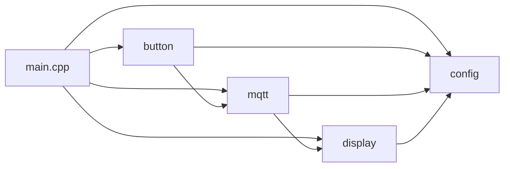
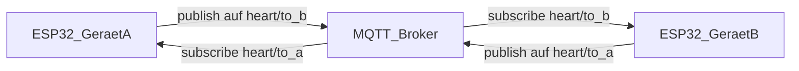
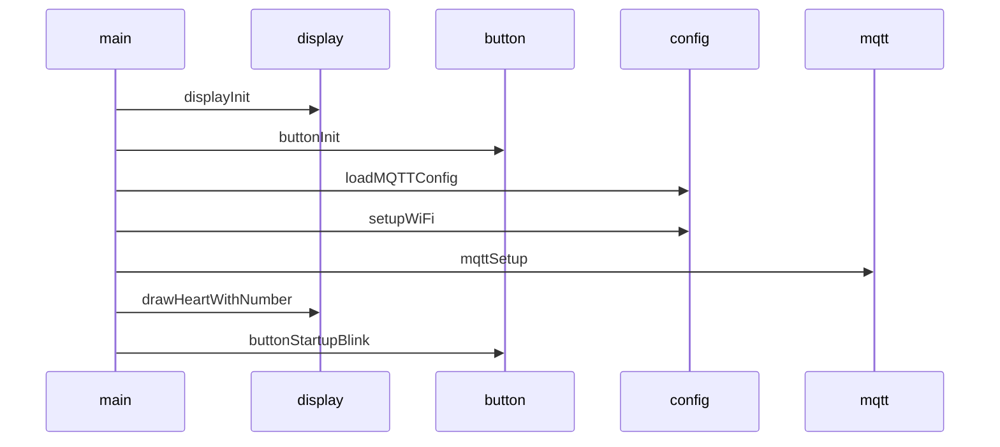
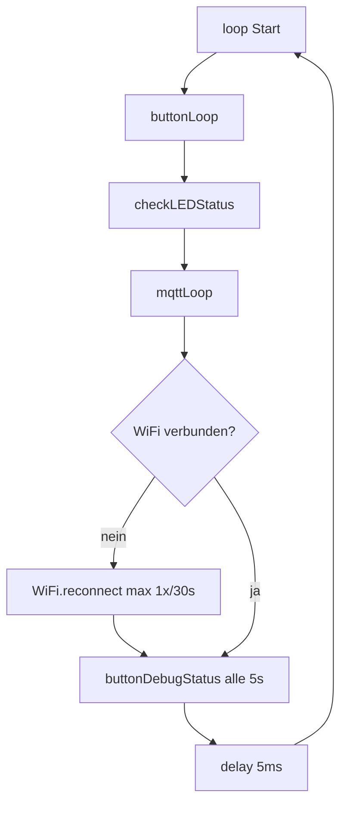

# Architektur

## Moduluebersicht

Die Firmware ist in **vier logische Module** plus `main.cpp` aufgeteilt:

| Modul | Dateien | Aufgabe |
|--------|---------|---------|
| **config** | `config.h`, `config.cpp` | MQTT-Werte aus NVS (`Preferences`), WiFiManager-Captive-Portal, Factory Reset |
| **display** | `display.h`, `display.cpp` | GxEPD2-Initialisierung, Zeichnen Herz + Zahl |
| **mqtt** | `mqtt.h`, `mqtt.cpp` | TLS-Client, Broker-Verbindung, Subscribe/Publish, Callback erhoeht Counter |
| **button** | `button.h`, `button.cpp` | GPIO Taster + LED, Kurzdruck -> Publish, Langdruck -> Reset |

`main.cpp` **orchestriert** die Initialisierung und ruft in `loop()` die Modul-Loops auf.

## Abhaengigkeiten zwischen Modulen

- **mqtt** nutzt `mqtt_server`, `mqtt_port`, ... und `counter` aus **config** und ruft **display** auf (`requestHeartRedraw` / indirekt Zeichnung).
- **display** liest `counter` aus **config** fuer die Zahlendarstellung.
- **button** nutzt **config** (Reset, `counter`, Topic) und **mqtt** (`client`).

## Kommunikation: zwei Geraete ueber MQTT

Jedes Geraet hat **zwei getrennte Topics** -- ein **Sende-Topic** (`mqtt_topic_pub`) und ein **Empfangs-Topic** (`mqtt_topic_sub`). Diese werden im Captive Portal konfiguriert und **gekreuzt** eingerichtet:

- Geraet A publisht auf `heart/to_b`, subscribt auf `heart/to_a`
- Geraet B publisht auf `heart/to_a`, subscribt auf `heart/to_b`

Dadurch empfaengt jedes Geraet **nur die Nachrichten vom anderen** -- der eigene Knopfdruck erhoeht nicht den eigenen Counter.

Beim **Empfang** einer Nachricht auf dem Empfangs-Topic wird der lokale `counter` um 1 erhoeht und das Herz-Display neu gezeichnet. Der Payload (Counter-Wert des Senders als ASCII-String) wird nicht ausgewertet -- allein der Empfang loest `counter++` aus.

- **Transport:** `WiFiClientSecure` + `PubSubClient`
- **TLS:** `espClient.setInsecure()` -- keine Server-Zertifikatsvalidierung
- **Standard-Port in Konfiguration:** 8883

## Setup-Ablauf (`setup()`)

1. Serial 115200
2. Display hardware initialisieren
3. Button/LED-Pins
4. Gespeicherte MQTT-Parameter laden
5. WiFi (ggf. Captive Portal) + Speichern der Portal-Parameter
6. MQTT-Client konfigurieren (Server, Callback)
7. Erste Zeichnung mit `counter` (Start: 0)
8. LED-Startsequenz (3x Blink)

## Hauptschleife (`loop()`)

- **mqttLoop:** Bei Verbindungsverlust **nicht-blockierender** Reconnect (ein Versuch pro Abstand, Backoff 5--10 s)
- **WiFi:** bei Verlust `WiFi.reconnect()` hoechstens alle **30 s**
- **Display:** nach MQTT-Empfang nur Flag; `drawHeartWithNumber()` laeuft in `loop()` wenn `consumeHeartRedraw()`
- **Debug:** alle 5 s Button-/LED-Zustand auf Serial

## MQTT-Protokoll (praktisch)

| Aspekt | Wert |
|--------|------|
| Sende-Topic | Konfigurierbar, Default `heart/to_b` |
| Empfangs-Topic | Konfigurierbar, Default `heart/to_a` |
| Publish (Knopf) | Payload = ASCII-Ziffern (`snprintf` aus `counter`) auf Sende-Topic |
| Subscribe | Empfangs-Topic |
| Callback | Jede empfangene Nachricht -> `counter++`, NVS speichern, `requestHeartRedraw()`; Zeichnung in `loop()` |

Authentifizierung: optional ueber `mqtt_username` / `mqtt_password` aus dem Portal.

## Persistenz

- **WiFi:** WiFiManager speichert Zugangsdaten intern.
- **MQTT:** Namespace `mqtt` in `Preferences` (`server`, `port`, `user`, `pass`, `topic_pub`, `topic_sub`).
- **Zaehler:** Namespace `heart`, Key `counter` (wird bei MQTT-Empfang aktualisiert; Factory Reset loescht mit).

Siehe [MODULES.md](MODULES.md) fuer Funktionsdetails.
