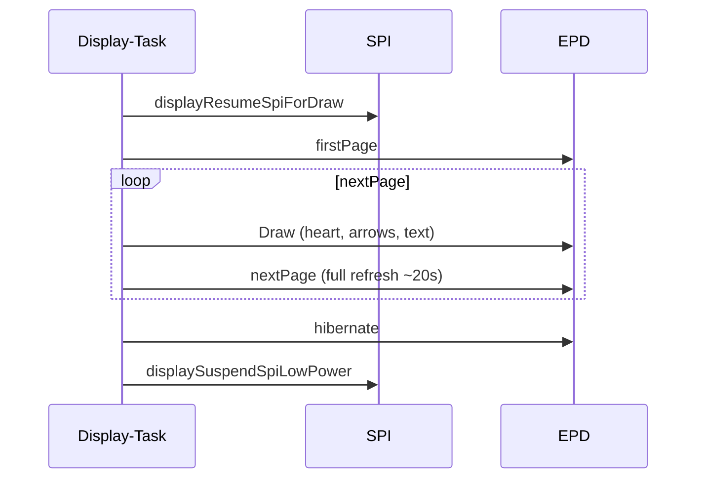

# Display

The E-Ink display shows a **red heart** with **RX and TX counters** (delta display). All drawing takes place exclusively in the **display task**—other tasks send commands via `g_displayCmdQueue`.

## Display task

| Parameter | Value |
|-----------|-------|
| Stack | 4096 Bytes |
| Priority | 3 |
| Core | 1 |
| WDT | **Not registered** (a 1.54G full refresh can take ~20 s) |
| Boot initialization | `displayInit()` with `initial_full_refresh=false`—the first full refresh occurs with the first draw command |

### Commands (`DisplayMsg`)

| Command | Function | Trigger |
|---------|----------|---------|
| `DrawHeart` | `drawHeartWithNumber()` | MQTT reception, publish, setup, counter reset |
| `DrawSplash` | `drawSplashScreen()` | Setup without a configured broker (AP mode) |

### API for other tasks

| Function | Blocking | Timeout |
|----------|----------|---------|
| `requestHeartRedraw()` | Yes (100 ms queue) | For main/button |
| `requestHeartRedrawNonBlocking()` | No (0 ms) | For MQTT callback |
| `requestDeferredDrawSplashScreen()` | Yes (100 ms) | Setup |
| `requestDeferredDrawHeartScreen()` | Yes (100 ms) | Setup |

## Counter delta vs. absolute value

The display shows **deltas**, while MQTT transports **absolute** values:

```
Displayed RX = max(0, heartCounter − counterBaseline), capped at 999
Displayed TX = max(0, heartSentCounter − sentCountBaseline), capped at 999
```

| Variable | MQTT | Display | NVS |
|----------|------|---------|-----|
| `heartCounter` | Absolute (received) | Delta via baseline | `chaya/counter` |
| `heartSentCounter` | Absolute (sent) | Delta via baseline | `chaya/sentCount` |
| `counterBaseline` | – | RX baseline | `chaya/cntBase` |
| `sentCountBaseline` | – | TX baseline | `chaya/sntBase` |

### Example

| Action | heartCounter | counterBaseline | Displayed RX |
|--------|--------------|-----------------|--------------|
| Start | 0 | 0 | 0 |
| Partner sends 42 | 42 | 0 | 42 |
| Periodic reset (day 7) | 42 | 42 | 0 |
| Partner sends 50 | 50 | 42 | 8 |

### Overflow (≥999)

When a displayed delta reaches ≥ **999** (`kDisplayCounterMax` in `display/display_config.h`):
- The display shows `"999+"` when the delta is **greater than** 999 (exactly 999 is shown as `999`; the app can then advance the baseline)
- `maybeResetDisplayBaselinesWhenCapped()` sets the baseline to the current raw value
- The display returns to 0

## Heart geometry

Constants in `display/draw.cpp`:

| Parameter | Value | Description |
|-----------|-------|-------------|
| `kCenterX` | 100 | X coordinate of the heart's center |
| `kHeartSize` | 70 | Heart size |
| `kCircleRadius` | 45 | Radius of the two heart circles |
| `kCircleSpacing` | 32 | Distance between the circles and the center |
| `kCircleY` | 50 | Y position of the circles |
| `kTriangleTop` | 65 | Top point of the triangle |
| `kTriangleBottom` | 163 | Bottom point of the triangle |

Structure:
1. Two red circles (`GxEPD_RED`) at the top
2. A red triangle as the point of the heart
3. A red rectangle connecting them
4. Arrows (RX at bottom left ↓, TX at top right ↑) in the foreground color
5. Counters at the bottom (RX on the left, TX on the right) in the foreground color

### Dark Mode

Persistent setting `cfg/disp_dark` (API `displayDark` / form field `display_dark`), independent of the web UI theme:

| Mode | Background | Counters/arrows | Heart |
|------|------------|-----------------|-------|
| Light (`0`, default) | White | Black | Red |
| Dark (`1`) | Black | White | Red |

After a change is saved, `requestDeferredDrawHeartScreen()` is triggered immediately (without counter throttling). The splash text uses the same palette.

## Text rendering

| Number of digits | TextSize |
|------------------|----------|
| ≤3 digits | 4 |
| ≥4 digits | 3 |

Centering uses `getTextBounds()` after dynamic `setTextSize`. For deltas **> 999**, `"999+"` is displayed.

Footer position: Y=167, RX on the left (margin 4 + arrow lane 26), TX on the right (symmetrical).

## Refresh sequence



1. Enable SPI (`displayResumeSpiForDraw`)
2. `firstPage()` → draw → `nextPage()` (full refresh ~20 s; fast ~15 s)
3. `hibernate()`—controller deep sleep; the image remains bistable
4. Put SPI into low-power mode (`displaySuspendSpiLowPower`, `gpio_hold` on CS)

## Splash display

| Screen | Content | TextSize |
|--------|---------|----------|
| `drawSplashScreen()` | „Chaya2MQTT" | 3 (min 1) |

## SPI Low-Power

SPI is disabled between draws:
- SCK/MOSI/MISO as inputs with pull-down
- CS as output HIGH with `gpio_hold_en`
- Reduces power consumption and glitches

## EPD driver

Onboard Waveshare 1.54G panel. See [HARDWARE.md](HARDWARE.md).

[GxEPD2](https://github.com/ZinggJM/GxEPD2) (`ZinggJM/GxEPD2`):
- 200 × 200, black / white / **red** / yellow
- `GxEPD2_4C` paging (`firstPage()` / `nextPage()`)
- Alias: `ChayaEpdPanel` in `src/display/internal.h`
- Full-window refresh (~20 s); fast mode ~15 s
- Enable panel power on GPIO6 before drawing
- Colors: `GxEPD_BLACK`, `GxEPD_WHITE`, `GxEPD_RED`, `GxEPD_YELLOW` — the heart uses red

## Further documentation

- Counter logic: [heart/counter](../src/heart/counter.h) → [CONFIGURATION.md](CONFIGURATION.md)
- Architecture (display task): [ARCHITECTURE.md](ARCHITECTURE.md)
