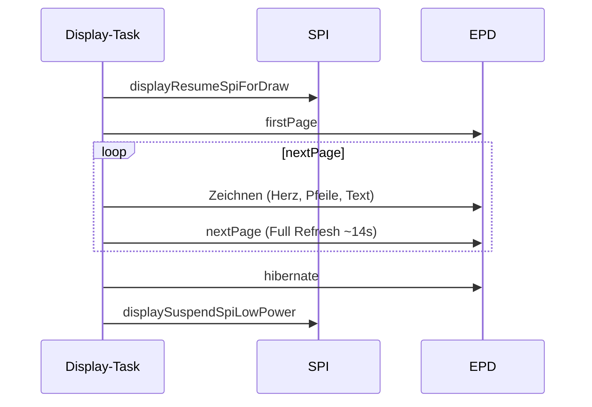

# Display

Das E-Ink-Display zeigt ein **rotes Herz** mit **RX- und TX-Zählerständen** (Delta-Anzeige). Alle Zeichnungen laufen ausschließlich im **Display-Task** – andere Tasks senden Befehle über die `g_displayCmdQueue`.

## Display-Task

| Parameter | Wert |
|-----------|------|
| Stack | 4096 Bytes |
| Priorität | 3 |
| Core | 1 |
| WDT | **Nicht angemeldet** (Full Refresh kann >5 s dauern) |

### Befehle (`DisplayMsg`)

| Befehl | Funktion | Auslöser |
|--------|----------|----------|
| `DrawHeart` | `drawHeartWithNumber()` | MQTT-Empfang, Publish, Setup, Counter-Reset |
| `DrawSplash` | `drawSplashScreen()` | Setup ohne konfigurierten Broker (AP-Modus) |
| `DrawAuthPrompt` | `drawAuthPrompt()` | Web-Auth: „Web Auth?" |
| `DrawAuthCode` | `drawAuthCode(code)` | Web-Auth: 6-stelliger Code |

### API für andere Tasks

| Funktion | Blockierend | Timeout |
|----------|-------------|---------|
| `requestHeartRedraw()` | Ja (100 ms Queue) | Für Main/Button |
| `requestHeartRedrawNonBlocking()` | Nein (0 ms) | Für MQTT-Callback |
| `requestDeferredDrawAuthPrompt()` | Ja (2000 ms) | Web-Auth |
| `requestDeferredDrawAuthCode(code)` | Ja (2000 ms) | Web-Auth |
| `requestDeferredDrawSplashScreen()` | Ja (100 ms) | Setup |
| `requestDeferredDrawHeartScreen()` | Ja (100 ms) | Setup |

## Zähler-Delta vs. Absolut

Das Display zeigt **Deltas**, MQTT transportiert **absolute** Werte:

```
Anzeige RX = max(0, heartCounter − counterBaseline), gecappt bei 999
Anzeige TX = max(0, heartSentCounter − sentCountBaseline), gecappt bei 999
```

| Variable | MQTT | Display | NVS |
|----------|------|---------|-----|
| `heartCounter` | Absolut (empfangen) | Delta via Baseline | `chaya/counter` |
| `heartSentCounter` | Absolut (gesendet) | Delta via Baseline | `chaya/sentCount` |
| `counterBaseline` | – | RX-Basis | `chaya/cntBase` |
| `sentCountBaseline` | – | TX-Basis | `chaya/sntBase` |

### Beispiel

| Aktion | heartCounter | counterBaseline | Anzeige RX |
|--------|-------------|-----------------|------------|
| Start | 0 | 0 | 0 |
| Partner sendet 42 | 42 | 0 | 42 |
| Periodischer Reset (Tag 7) | 42 | 42 | 0 |
| Partner sendet 50 | 50 | 42 | 8 |

### Overflow (≥999)

Wenn ein Anzeige-Delta ≥ **999** (`kDisplayCounterMax`) erreicht:
- Anzeige zeigt `"999+"` wenn der Delta-Wert **größer als** 999 ist (bei exakt 999 wird `999` gezeigt; danach kann die App-Baseline nachziehen)
- `maybeResetDisplayBaselinesWhenCapped()` setzt die Baseline auf den aktuellen Raw-Wert
- Anzeige springt zurück auf 0

## Herz-Geometrie

Konstanten in `display/draw.cpp`:

| Parameter | Wert | Beschreibung |
|-----------|------|--------------|
| `kCenterX` | 100 | Herz-Mittelpunkt X |
| `kHeartSize` | 70 | Herz-Größe |
| `kCircleRadius` | 45 | Radius der beiden Herz-Kreise |
| `kCircleSpacing` | 32 | Abstand der Kreise vom Zentrum |
| `kCircleY` | 50 | Y-Position der Kreise |
| `kTriangleTop` | 65 | Spitze des Dreiecks (oben) |
| `kTriangleBottom` | 163 | Spitze des Dreiecks (unten) |

Aufbau:
1. Zwei rote Kreise (`GxEPD_RED`) oben
2. Rotes Dreieck als Herzspitze
3. Rotes Rechteck als Verbindung
4. Schwarze Pfeile (RX unten links ↓, TX oben rechts ↑)
5. Schwarze Zähler unten (RX links, TX rechts)

## Text-Rendering

| Stellenzahl | TextSize |
|-------------|----------|
| ≤3 Ziffern | 4 |
| ≥4 Ziffern | 3 |

Zentrierung über `getTextBounds()` nach dynamischem `setTextSize`. Bei Delta **> 999** wird `"999+"` angezeigt.

Footer-Position: Y=167, RX links (Margin 4 + Arrow-Lane 26), TX rechts (symmetrisch).

## Refresh-Ablauf



1. SPI aktivieren (`displayResumeSpiForDraw`)
2. `firstPage()` → Zeichnen → `nextPage()` (Full Refresh, ~8–14 s)
3. `hibernate()` – Controller Deep Sleep, Bild bleibt bistabil
4. SPI low-power (`displaySuspendSpiLowPower`, `gpio_hold` auf CS)

## Auth-Anzeigen

| Screen | Inhalt | TextSize |
|--------|--------|----------|
| `drawAuthPrompt()` | „Web Auth?" | 3 (min 1) |
| `drawAuthCode(code)` | 6-stelliger Code | 4 (min 2) |
| `drawSplashScreen()` | „Chaya2MQTT" | 3 (min 1) |

Nach Auth-Prompt/Code: `webAuthResetConfirmDeadline()` verlängert das 10-s-Tastenfenster (E-Ink-Draw blockiert).

## SPI Low-Power

Zwischen Draws wird SPI deaktiviert:
- SCK/MOSI/MISO als Input mit Pulldown
- CS als Output HIGH mit `gpio_hold_en`
- Reduziert Stromverbrauch und Glitches

## EPD-Treiber

[GxEPD2](https://github.com/ZinggJM/GxEPD2) als PlatformIO-Library (`ZinggJM/GxEPD2`):
- Panel: `GxEPD2_154_Z90c` (200×200, 3-Farben BWR)
- Wrapper: `GxEPD2_3C<…>` für Paging (`firstPage()` / `nextPage()`)
- Alias `ChayaEpdPanel` in `src/display/internal.h`
- Full-Window-Refresh only (~8–14 s)

Details: [HARDWARE.md](HARDWARE.md)

## Weitere Dokumentation

- Zähler-Logik: [heart/counter](../src/heart/counter.h) → [CONFIGURATION.md](CONFIGURATION.md)
- Architektur (Display-Task): [ARCHITECTURE.md](ARCHITECTURE.md)
- Web-Auth-Flow: [WEB_ADMIN.md](WEB_ADMIN.md)
