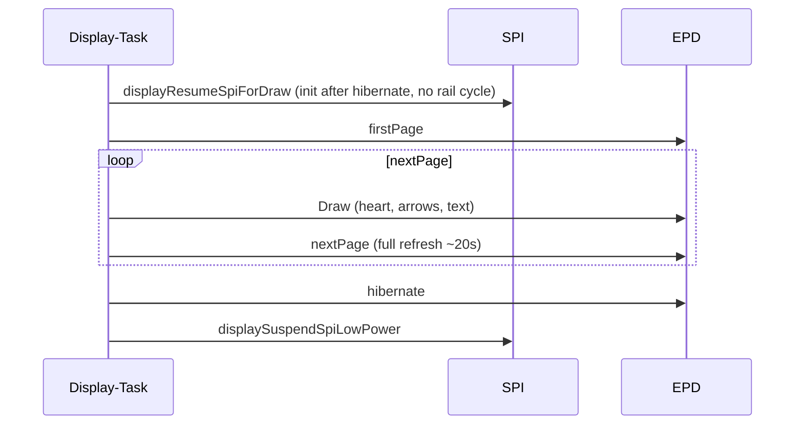

# Display

The E-Ink display shows a **Lucide heart** with **RX and TX counters** (delta display), Lucide **arrow** glyphs, and a Lucide **battery** icon (same thresholds as the web dashboard). The offline cracked-heart view omits the counters. The battery appears top-right on the filled-heart, cracked-heart, and centered product-title screens, but not on SoftAP/setup or power-off. All drawing takes place exclusively in the **display task**—other tasks send commands via `g_displayCmdQueue`. The user LED pulses for the duration of a heart/splash refresh.

## Views (simulated)

Pixel-accurate host previews of the 200×200 panel (scaled 4×). Generated from firmware Lucide bitmaps and the Adafruit GFX classic font via `node scripts/render_display_previews.mjs` — no device photo required.

| Online heart | Offline (crack) | SoftAP WIFI QR |
|:---:|:---:|:---:|
|  |  |  |

| Product title | Power-off |
|:---:|:---:|
|  |  |

## Display task

| Parameter | Value |
|-----------|-------|
| Stack | 8192 Bytes |
| Priority | 3 |
| Core | 1 |
| WDT | **Not registered** (a 1.54G full refresh can take ~20 s) |
| Boot initialization | `displayInit()` with `initial_full_refresh=true`—wakes the panel after hibernate, first draw is a full refresh |

### Commands (`DisplayMsg`)

| Command | Function | Trigger |
|---------|----------|---------|
| `DrawHeart` | `drawHeartWithNumber(icon)` | MQTT reception, publish, setup, counter reset, link-status icon change |
| `DrawSplash` | `drawSplashScreen()` | SoftAP setup: full-screen WIFI QR (`T:WPA`) for phone camera join |
| `DrawPowerOff` | `drawPowerOffScreen()` | Controlled shutdown: centered red Lucide `heart-off` |

The last successfully painted view is cached in `cfg/disp_view`: unknown, filled heart, setup QR, product title, cracked heart, or power-off. Before each waveform the display task persists `unknown`; it commits the target view only after the refresh completes. A watchdog reset, brownout, or power loss mid-refresh therefore forces the next boot to repaint instead of trusting a partial gray frame. Boot/setup requests are skipped when the exact completed view is already on the bistable panel. Setup QR, product title, filled heart, cracked heart, and power-off are distinct views. Normal RX/TX heart redraws remain content-driven (counters **or** heart icon) and are never suppressed solely because a heart-family view is active.

On controlled shutdown, the power-off glyph is still painted after a heart or setup QR. If the power-off view is already visible, the refresh is skipped and shutdown continues immediately. The NVS value is written only after a completed refresh and only when the view changes.

### API for other tasks

| Function | Blocking | Timeout |
|----------|----------|---------|
| `requestHeartRedraw()` | Yes (100 ms queue) | For main/button |
| `requestHeartRedrawNonBlocking()` | No (0 ms) | For MQTT callback |
| `requestDeferredDrawSplashScreen()` | Yes (100 ms) | Setup |
| `requestDeferredDrawHeartScreen()` | Yes (100 ms) | Setup |
| `displayDrawPowerOffAndWait()` | Yes (dedicated completion semaphore) | PWR shutdown |
| `displaySetDesiredHeartIcon()` | No | App task link monitor |

## Heart link status (filled vs crack)

In STA mode the heart glyph tracks connectivity:

| Glyph | Condition |
|-------|-----------|
| Lucide **heart** (filled, red) | Wi-Fi **and** MQTT connected, or outage shorter than grace |
| Lucide **heart-crack** (outline, red) | Wi-Fi **or** MQTT continuously down for **5 minutes** (`kDisplayOfflineGraceMs`) |

Filled heart shows RX/TX counters and battery. Cracked heart is horizontally and vertically centered with battery only (no footer counters). Recovery is immediate when both links are healthy again. SoftAP/setup keeps the QR splash and never switches to crack. The app task polls every ~500 ms and only queues a redraw when the glyph actually changes (still subject to the 20 s heart redraw coalescing).

## Counter delta vs. absolute value

The display shows **deltas**, while MQTT transports **absolute** values:

```
Displayed RX = max(0, heartCounter − counterBaseline), capped at 999
Displayed TX = max(0, heartSentCounter − sentCountBaseline), capped at 999
```

| Variable | MQTT | Display | NVS |
|----------|------|---------|-----|
| `heartCounter` | Absolute (received) | Delta via baseline | `chaya/counter` |
| `heartSentCounter` | Absolute (sent) | Delta via baseline | `chaya/sentCount` |
| `counterBaseline` | – | RX baseline | `chaya/baseBlob` (legacy `cntBase`) |
| `sentCountBaseline` | – | TX baseline | `chaya/baseBlob` (legacy `sntBase`) |

### Example

| Action | heartCounter | counterBaseline | Displayed RX |
|--------|--------------|-----------------|--------------|
| Start | 0 | 0 | 0 |
| Partner sends 42 | 42 | 0 | 42 |
| Periodic reset (day 7) | 42 | 42 | 0 |
| Partner sends 50 | 50 | 42 | 8 |

### Overflow (≥999)

When a displayed delta reaches ≥ **999** (`kDisplayCounterMax` in `display/display_config.h`):
- The display shows `"999+"` when the delta is **greater than** 999 (exactly 999 is shown as `999`; the app can then advance the baseline)
- `maybeResetDisplayBaselinesWhenCapped()` sets the baseline to the current raw value
- The display returns to 0

## Lucide icons

Bitmaps are pre-rasterized from Lucide (`scripts/generate_display_icons.mjs` → `src/display/icons_lucide.h`, ISC license) and drawn with Adafruit GFX `drawBitmap()`.

| Element | Glyph | Color | Position (200×200) |
|---------|-------|-------|--------------------|
| Heart (online) | `heart` | Red | Horizontally centered above footer (~y=24) |
| Heart (offline) | `heart-crack` | Red | Horizontally and vertically centered |
| RX movement | `move-down` | Black | Bottom left (online heart only) |
| TX movement | `move-up` | Black | Footer right (online heart only) |
| Battery | `battery-full` / `medium` / `low` / empty `battery` | See below | Top right on heart, crack, and product-title; omitted on SoftAP and power-off |
| Power-off | `heart-off` | Black below red `Chaya2MQTT` | Centered |

### Battery thresholds (match web GUI)

| Percent | Lucide icon | E-Ink color |
|---------|-------------|-------------|
| ≥ 80 | `battery-full` | Black |
| ≥ 40 | `battery-medium` | Black |
| ≥ 15 | `battery-low` | Yellow |
| < 15 | empty `battery` | Red |

Palette: white background, black counters/arrows, red heart glyphs. The SoftAP splash title stays red text above the WIFI QR and does not show the battery icon.

## Text rendering

| Number of digits | TextSize |
|------------------|----------|
| ≤3 digits | 4 |
| ≥4 digits | 3 |

Centering uses `getTextBounds()` after dynamic `setTextSize`. For deltas **> 999**, `"999+"` is displayed.

Footer position: Y=167, with a 5 px visual gap between each movement icon and counter.

## Refresh sequence



1. Compare state-driven requests with `cfg/disp_view`; signal completion without touching the panel when the view is unchanged
2. Persist `cfg/disp_view=unknown` before touching the panel
3. Enter the WLAN low-interference window; active scans are paused, new connection tests are refused,
   and GOT_IP, reconnect, recovery, MQTT teardown, and settings apply remain pending
4. `displayResumeSpiForDraw` — after `hibernate()`, GxEPD2 `init(0, true, 2, false)` (RST only; rail and SPI stay up)
5. `setFullWindow()` → `firstPage()` → draw → `nextPage()` (full refresh ~20 s; fast ~15 s)
6. `hibernate()` — controller deep sleep; the image remains bistable
7. Leave the low-interference window and persist the completed view

## Splash display

| Screen | Content | TextSize |
|--------|---------|----------|
| SoftAP `SetupQr` | Red „Chaya2MQTT" above a bottom-aligned WIFI QR; no battery | Title 3 (min 1) |
| Product `ProductTitle` | Centered red „Chaya2MQTT" with top-right battery | Title 3 (min 1) |

## Panel power / SPI

Follows Waveshare [`08_E_paper_test`](https://github.com/waveshareteam/ESP32-S3-ePaper-1.54G/tree/main/Example/Arduino_3.2.0/examples/08_E_paper_test) and GxEPD2:
- `EPD3V3_EN` (GPIO6) LOW once at boot (`digitalWrite(EPD_PWR, LOW)`); no rail cycle between frames
- Custom SPI pins (`SCK=12`, `MOSI=13`, `CS=11`) attached **before** `init()` so ESP32-S3 defaults do not swap CS/SDI
- SPI stays attached between draws; `hibernate()` wakes via RST, not `SPI.end()`
- Reset: RST HIGH 200 ms, LOW 2 ms, HIGH 200 ms (`EPD_1IN54G_Reset`)
- Busy: 100 ms then wait until BUSY is HIGH (`EPD_1IN54G_ReadBusyH`)
- First frame is painted in `setup()` **before** SoftAP RF comes up

## EPD driver

Onboard Waveshare 1.54G panel. See [HARDWARE.md](HARDWARE.md).

[GxEPD2](https://github.com/ZinggJM/GxEPD2) (`ZinggJM/GxEPD2`):
- 200 × 200, black / white / **red** / yellow
- `GxEPD2_4C` / `GxEPD2_154c_GDEM0154F51H` paging (`firstPage()` / `nextPage()`)
- Alias: `ChayaEpdPanel` in `src/display/internal.h`
- Full-window refresh (~20 s); fast mode ~15 s
- Enable panel power on GPIO6 **LOW** before drawing (active-low `EPD3V3_EN`)
- Colors: `GxEPD_BLACK`, `GxEPD_WHITE`, `GxEPD_RED`, `GxEPD_YELLOW` — heart glyphs use red; yellow is reserved for the low-battery icon

## Further documentation

- Counter logic: [heart/counter](../src/heart/counter.h) → [CONFIGURATION.md](CONFIGURATION.md)
- Architecture (display task): [ARCHITECTURE.md](ARCHITECTURE.md)
