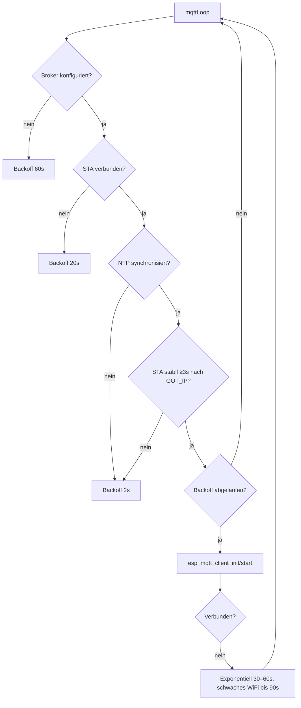
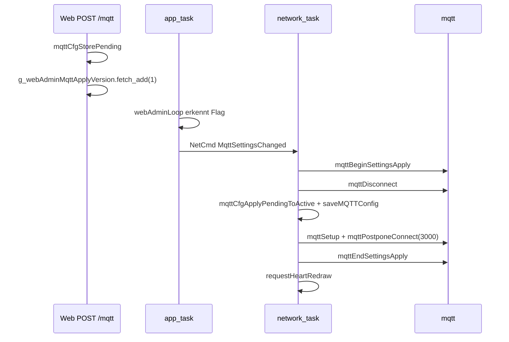

# MQTT-Protokoll

## Transport

| Aspekt | Wert |
|--------|------|
| Protokoll | **MQTT over TLS** (`mqtts://`) |
| Standard-Port | **8883** |
| TLS | Mozilla-CA-Bundle via `esp_crt_bundle_attach` |
| Client | ESP-IDF `esp_mqtt_client` (kein PubSubClient) |
| Client-ID | `Chaya2MQTT-<deviceId>` oder `Chaya2MQTT-<random>` |
| Keep-Alive | 60 s (`kMqttKeepAliveSeconds` in `mqtt/mqtt_config.h`) |
| Buffer | 512 Bytes (in/out) |
| Outbox-Limit | 4096 Bytes (`kMqttOutboxLimitBytes`) |
| Auto-Reconnect (ESP-IDF) | deaktiviert – Reconnect nur in `mqttLoop()` |

## Topics

Topics sind **nicht** nutzereditierbar. Sie werden aus der eigenen Device-ID und der Partner-ID abgeleitet:

| Topic | Ableitung | Richtung |
|-------|-----------|----------|
| **Sende-Topic** | `chaya2mqtt/<eigene_id>` (z. B. `chaya2mqtt/a1b2c3`) | Publish beim Knopfdruck / Web-Send |
| **Empfangs-Topic** | `chaya2mqtt/<partner_id>` (z. B. `chaya2mqtt/f5e6d7`) | Subscribe – nur wenn Partner gesetzt |

Ohne Partner verbindet sich das Gerät weiterhin mit dem Broker und publiziert auf dem eigenen Topic, **abonniert aber kein Geräte-Topic**.

Die Device-ID sind die letzten 3 Bytes der WiFi-MAC als 6-stelliges Hex (lowercase):

```
Device-ID = sprintf("%02x%02x%02x", mac[3], mac[4], mac[5])
```

Mehrere Paare können denselben Broker nutzen, ohne Topic-Kollisionen.

### Zwei Geräte koppeln

1. Auf beiden Geräten **MQTT** öffnen (`/mqtt`) und denselben Broker eintragen.
2. Die eigene Device-ID notieren und auf dem jeweils anderen Gerät als **Partner-ID** speichern.
3. Topics werden automatisch gesetzt (`mqttCfgApplyPairingTopics`).

Broker und Partner werden atomar über `POST /api/mqtt` gespeichert. Leere Partner-ID entkoppelt ohne Brokerverlust.

## Nachrichtenformat

### Publish (Knopf / Web-Send)

| Aspekt | Wert |
|--------|------|
| Payload | Dezimalstring = `heartSentCounter + 1` |
| QoS | **0** |
| Retain | **true** |
| Beispiel | `"42"` |

Nach erfolgreichem Publish wird `heartSentCounter` inkrementiert und in NVS gespeichert (debounced, ≥30 s).

### Subscribe (Empfang)

| Aspekt | Wert |
|--------|------|
| QoS | **1** |
| Payload | Dezimalstring, max. **10 Zeichen** |
| Verarbeitung | `heartCounter` wird auf den Payload-Wert **gesetzt** (nicht inkrementiert) |
| Ungültig | Leer, nicht-numerisch, >10 Zeichen, `ERANGE` → ignoriert |
| Display | `requestHeartRedrawNonBlocking()` nur bei geänderter Zahl |

Retained Messages liefern beim Reconnect automatisch den letzten Zählerstand.

### Last Will and Testament (LWT)

| Aspekt | Wert |
|--------|------|
| Topic | `{topic_pub}/lwt` |
| Payload (offline) | `offline` |
| Payload (online) | `online` (retained, nach Connect) |
| QoS | **1** |
| Retain | **true** |

## Verbindungsaufbau

`mqttLoop()` (im Network-Task) steuert den Reconnect:



| Bedingung | Backoff |
|-----------|---------|
| Kein Broker konfiguriert | 60 s |
| Kein STA | 20 s |
| NTP nicht synchronisiert / STA nicht stabil | 2 s |
| Verbindungsfehler | 30 s initial, max. 60 s (schwaches WiFi: max. 90 s) |

Nach MQTT-Settings-Änderung (Web-UI): Connect wird um **3 s** verzögert (`mqttPostponeConnect`).

## Robustheit (gegenüber Gaggimate)

Chaya2MQTT behält bewusst **ESP-IDF `esp_mqtt_client`** statt `256dpi/MQTT`:

| Aspekt | Chaya2MQTT | Gaggimate (master MQTTPlugin) |
|--------|------------|-------------------------------|
| Transport | nur MQTTS + CA-Bundle | Plain MQTT / WiFiClient |
| LWT | retained online/offline | fehlt |
| Client-ID | gerätebezogen (`Chaya2MQTT-<id>`) | fest `"GaggiMate"` |
| Reconnect | eigener Backoff in `mqttLoop()` | nur indirekt über WiFi-Events |
| Generation-Guard | Events nach Client-Destroy ignoriert | — |
| Settings-Apply | Publish gesperrt, Kill+Rebuild | Plugin nur beim Boot |

WLAN- und MQTT-Backoff sind entkoppelt: TLS-/Broker-Fehler erzeugen keine WiFi-Reconnect-Schleife. Manuelle Hardware-Szenarien: Broker-Neustart, WLAN-Unterbrechung, Wiederanmeldung — siehe [TESTING.md](TESTING.md).

## Konfigurations-API

Die aktive MQTT-Konfiguration lebt nur in `mqtt/config.cpp`. Zugriff ausschließlich über:

| Funktion | Zweck |
|----------|-------|
| `mqttCfgSnapshot(MqttConfig*)` | Thread-safe Kopie der aktiven Config |
| `mqttCfgStorePending(const MqttConfig*)` | Web-Formular → Pending-Config |
| `mqttCfgApplyPendingToActive()` | Pending → Active (Network-Task) |
| `mqttCfgApplyPairingTopics(MqttConfig*)` | Topics aus eigener ID + Partner-ID ableiten |
| `mqttCfgTopicPubLockedCopy(char*, size_t)` | Sende-Topic unter Mutex |
| `mqttCfgIsBrokerConfigured()` | Server-Feld nicht leer? |
| `mqttCfgHasUnappliedPending()` | Pending noch nicht angewendet? |

### MqttConfig-Struct

```cpp
struct MqttConfig {
    char     server[128];
    uint16_t port;              // Default: 8883
    char     username[64];
    char     password[64];
    char     topicPub[128];     // derived: chaya2mqtt/<own>
    char     topicSub[128];     // derived: chaya2mqtt/<partner>, or empty
    char     partnerDeviceId[7]; // 6 Hex + NUL
};
```

Defaults und Protokoll-Limits: `mqtt/mqtt_config.h`. Backoff/Timing: `mqtt/mqtt_timing.h`.

## NVS-Speicherung

Namespace `mqtt`:

| Key | Typ | Beschreibung |
|-----|-----|--------------|
| `server` | String | Broker-Hostname/IP |
| `port` | Int | Port (Default 8883) |
| `user` | String | MQTT-Username |
| `pass` | String | MQTT-Passwort |
| `partner_id` | String | Partner-Device-ID (6 Hex) |

Topics werden nicht mehr in NVS persistiert; beim Speichern werden Legacy-Keys `topic_pub` / `topic_sub` entfernt.

Details: [CONFIGURATION.md](CONFIGURATION.md)

## Settings-Apply-Flow (Web-UI)



Während `mqttBeginSettingsApply` … `mqttEndSettingsApply` sind Publishes blockiert (`mqttPublishBlocked()`).

## Sicherheit

- TLS mit Zertifikatsprüfung gegen Mozilla-CA-Bundle
- Broker muss ein Zertifikat einer öffentlichen CA haben
- Credentials in NVS unverschlüsselt (siehe [SECURITY.md](SECURITY.md))
