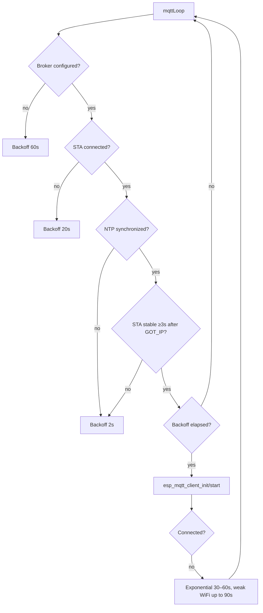
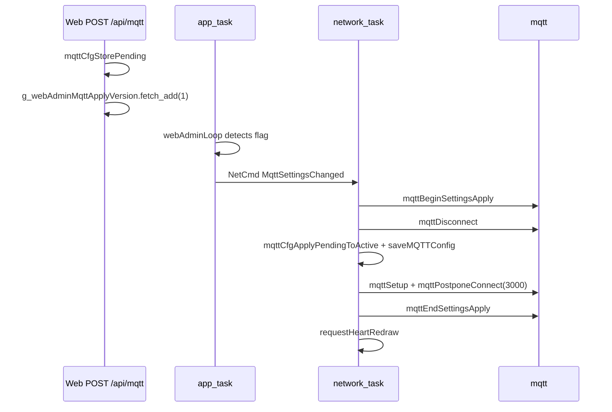

# MQTT Protocol

## Transport

| Aspect | Value |
|--------|-------|
| Protocol | **MQTT over TLS** (`mqtts://`) |
| Default port | **8883** |
| TLS | Mozilla CA bundle via `esp_crt_bundle_attach` |
| Client | ESP-IDF `esp_mqtt_client` (not PubSubClient) |
| Client ID | `Chaya2MQTT-<deviceId>` or `Chaya2MQTT-<random>` |
| Keep-Alive | 60 s (`kMqttKeepAliveSeconds` in `mqtt/mqtt_config.h`) |
| Buffer | 512 bytes (in/out) |
| Outbox limit | 4096 bytes (`kMqttOutboxLimitBytes`) |
| Auto-reconnect (ESP-IDF) | Disabled—reconnect only in `mqttLoop()` |

## Topics

Topics are **not** user-editable. They are derived from the device's own ID and the partner ID:

| Topic | Derivation | Direction |
|-------|------------|-----------|
| **Publish topic** | `chaya2mqtt/<own_id>` (e.g. `chaya2mqtt/a1b2c3`) | Publish on button press / web send |
| **Subscribe topic** | `chaya2mqtt/<partner_id>` (e.g. `chaya2mqtt/f5e6d7`) | Subscribe—only if a partner is set |

Without a partner, the device still connects to the broker and publishes to its own topic, **but does not subscribe to a device topic**.

The device ID is a random 6-character lowercase hex string stored in NVS (`cfg/device_id`).
Factory reset and flash erase clear that key so the next boot gets a **new** ID (and therefore
new MQTT topics), which avoids picking up old retained broker state after a wipe. On OTA from
older firmware without `device_id`, the previous MAC-derived ID is written once when WiFi/MQTT
config already exists.

```
Device-ID = sprintf("%02x%02x%02x", random_byte0, random_byte1, random_byte2)  // persisted in NVS
```

Multiple pairs can use the same broker without topic collisions as long as their device IDs are unique. The six-character ID has a 24-bit namespace; a duplicate is unlikely for a few home devices, but would also duplicate MQTT client IDs and topics. The same ID is used as the suffix of the unique LAN hostname `chaya2mqtt-<deviceId>.local`.

### Pairing two devices

1. Open **MQTT** (`/mqtt`) on both devices and enter the same broker.
2. Note each device's own ID and save it as the **partner ID** on the other device.
3. Topics are set automatically (`mqttCfgApplyPairingTopics`).

The broker and partner are saved atomically through `POST /api/mqtt`. An empty partner ID unpairs the device without losing the broker configuration.

## Message format

### Publish (button / web send)

| Aspect | Value |
|--------|-------|
| Payload | Decimal string = `heartSentCounter + 1` |
| QoS | **1** |
| Retain | **true** |
| Example | `"42"` |

The send call waits up to **5 seconds** for the matching `MQTT_EVENT_PUBLISHED` (PUBACK).
Only that generation- and message-ID-bound acknowledgement increments and persists
`heartSentCounter`, triggers TX audio, and redraws the display. There is no automatic retry.
After a caller timeout, the in-flight value remains locked until a late PUBACK or disconnect;
after disconnect the same absolute retained value may be sent again, so QoS-1 duplicates are
idempotent for receivers.

### Subscribe (reception)

| Aspect | Value |
|--------|-------|
| QoS | **1** |
| Payload | Decimal string, maximum **10 characters** |
| Processing | `heartCounter` is **set** to the payload value (not incremented) |
| Invalid | Empty, non-numeric, >10 characters, `ERANGE` → ignored |
| Display | `requestHeartRedrawNonBlocking()` only when the number changes |

Retained messages automatically provide the latest counter on reconnect.

### Last Will and Testament (LWT)

| Aspect | Value |
|--------|-------|
| Topic | `{topic_pub}/lwt` |
| Payload (offline) | `offline` |
| Payload (online) | `online` (retained, after connection) |
| QoS | **1** |
| Retain | **true** |

## Establishing a connection

`mqttLoop()` (in the network task) controls reconnection:



| Condition | Backoff |
|-----------|---------|
| No broker configured | 60 s |
| No STA connection | 20 s |
| NTP not synchronized / STA not stable | 2 s |
| Connection error | 30 s initially, maximum 60 s (weak WiFi: maximum 90 s) |

After an MQTT settings change (web UI), connection is delayed by **3 s** (`mqttPostponeConnect`).

## Robustness (compared with Gaggimate)

Chaya2MQTT deliberately retains **ESP-IDF `esp_mqtt_client`** instead of `256dpi/MQTT`:

| Aspect | Chaya2MQTT | Gaggimate (master MQTTPlugin) |
|--------|------------|-------------------------------|
| Transport | MQTTS + CA bundle only | Plain MQTT / WiFiClient |
| LWT | Retained online/offline | Missing |
| Client ID | Device-specific (`Chaya2MQTT-<id>`) | Fixed `"GaggiMate"` |
| Reconnect | Dedicated backoff in `mqttLoop()` | Only indirectly through WiFi events |
| Generation guard | Events after client destruction are ignored | — |
| Settings application | Publishing blocked, kill + rebuild | Plugin only at boot |

WiFi and MQTT backoff are decoupled: TLS/broker errors do not cause a WiFi reconnect loop. Manual hardware scenarios include broker restart, WiFi interruption, and reconnection—see [TESTING.md](TESTING.md).

## Configuration API

The active MQTT configuration exists only in `mqtt/config.cpp`. It is accessed exclusively through:

| Function | Purpose |
|----------|---------|
| `mqttCfgSnapshot(MqttConfig*)` | Thread-safe copy of the active configuration |
| `mqttCfgStorePending(const MqttConfig*)` | Web form → pending configuration |
| `mqttCfgApplyPendingToActive()` | Pending → active (network task) |
| `mqttCfgApplyPairingTopics(MqttConfig*)` | Derive topics from own ID + partner ID |
| `mqttCfgTopicPubLockedCopy(char*, size_t)` | Copy publish topic under mutex |
| `mqttCfgIsBrokerConfigured()` | Is the server field non-empty? |
| `mqttCfgHasUnappliedPending()` | Is pending configuration not yet applied? |

### `MqttConfig` struct

```cpp
struct MqttConfig {
    char     server[128];
    uint16_t port;              // Default: 8883
    char     username[64];
    char     password[64];
    char     topicPub[128];     // derived: chaya2mqtt/<own>
    char     topicSub[128];     // derived: chaya2mqtt/<partner>, or empty
    char     partnerDeviceId[7]; // 6 Hex + NUL
};
```

Defaults and protocol limits: `mqtt/mqtt_config.h`. Backoff/timing: `mqtt/mqtt_timing.h`.

## NVS storage

Namespace `mqtt`:

| Key | Type | Description |
|-----|------|-------------|
| `server` | String | Broker hostname/IP (**required**) |
| `port` | Int | Port (default 8883; **required**) |
| `user` | String | MQTT username (optional; empty = anonymous) |
| `pass` | String | MQTT password (optional) |
| `partner_id` | String | Partner device ID, 6 hex (optional; empty = unpaired) |

Topics are no longer persisted in NVS; legacy keys `topic_pub` / `topic_sub` are removed when saving.

Details: [CONFIGURATION.md](CONFIGURATION.md)

## Settings application flow (web UI)



Publishing is blocked from `mqttBeginSettingsApply` through `mqttEndSettingsApply` (`mqttPublishBlocked()`).

## Security

- TLS with certificate validation against the Mozilla CA bundle
- The broker must have a certificate from a public CA
- Credentials are stored unencrypted in NVS.
