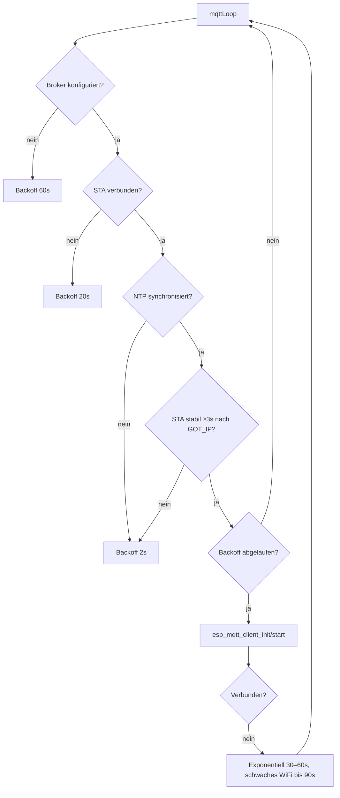
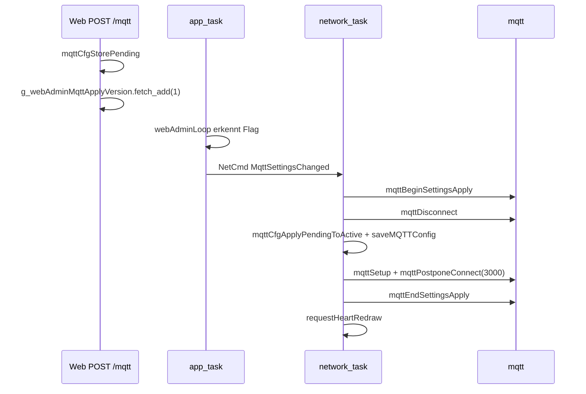

# MQTT-Protokoll

## Transport

| Aspekt | Wert |
|--------|------|
| Protokoll | **MQTT over TLS** (`mqtts://`) |
| Standard-Port | **8883** |
| TLS | Mozilla-CA-Bundle via `esp_crt_bundle_attach` |
| Client | ESP-IDF `esp_mqtt_client` (kein PubSubClient) |
| Client-ID | `Chaya2MQTT-<deviceId>` oder `Chaya2MQTT-<random>` |
| Keep-Alive | 60 s |
| Buffer | 512 Bytes (in/out) |
| Outbox-Limit | 4096 Bytes |
| Auto-Reconnect (ESP-IDF) | deaktiviert – Reconnect nur in `mqttLoop()` |

## Topics

Jedes Gerät hat zwei Topics:

| Topic | Konfigurationsfeld | Default | Richtung |
|-------|-------------------|---------|----------|
| **Sende-Topic** | `topicPub` | `chaya/to_b` | Publish beim Knopfdruck / Web-Send |
| **Empfangs-Topic** | `topicSub` | `chaya/to_a` | Subscribe – empfängt Partner-Nachrichten |

Topics werden **gekreuzt** konfiguriert, damit der eigene Knopf nicht den eigenen Counter erhöht.

### Manuelles Pairing (zwei Geräte)

| | Gerät A | Gerät B |
|---|---------|---------|
| Sende-Topic | `chaya/to_b` | `chaya/to_a` |
| Empfangs-Topic | `chaya/to_a` | `chaya/to_b` |

### Device-ID-Pairing (empfohlen)

Wenn eine **Partner-Device-ID** gesetzt ist, werden Topics automatisch überschrieben:

- **Sende-Topic:** `chaya/<eigene_id>` (z. B. `chaya/a1b2c3`)
- **Empfangs-Topic:** `chaya/<partner_id>` (z. B. `chaya/f5e6d7`)

Die Device-ID ist die letzten 3 Bytes der WiFi-MAC als 6-stelliges Hex (lowercase).

```
Device-ID = sprintf("%02x%02x%02x", mac[3], mac[4], mac[5])
```

Mehrere Paare können denselben Broker nutzen, ohne Topic-Kollisionen.

## Nachrichtenformat

### Publish (Knopf / Web-Send)

| Aspekt | Wert |
|--------|------|
| Payload | Dezimalstring = `heartSentCounter + 1` |
| QoS | **0** |
| Retain | **true** |
| Beispiel | `"42"` |

Nach erfolgreichem Publish wird `heartSentCounter` inkrementiert und in NVS gespeichert (debounced, ≥30 s).

### Subscribe (Empfang)

| Aspekt | Wert |
|--------|------|
| QoS | **1** |
| Payload | Dezimalstring, max. **10 Zeichen** |
| Verarbeitung | `heartCounter` wird auf den Payload-Wert **gesetzt** (nicht inkrementiert) |
| Ungültig | Leer, nicht-numerisch, >10 Zeichen, `ERANGE` → ignoriert |
| Display | `requestHeartRedrawNonBlocking()` nur bei geänderter Zahl |

Retained Messages liefern beim Reconnect automatisch den letzten Zählerstand.

### Last Will and Testament (LWT)

| Aspekt | Wert |
|--------|------|
| Topic | `{topic_pub}/lwt` |
| Payload (offline) | `offline` |
| Payload (online) | `online` (retained, nach Connect) |
| QoS | **1** |
| Retain | **true** |

## Verbindungsaufbau

`mqttLoop()` (im Network-Task) steuert den Reconnect:



| Bedingung | Backoff |
|-----------|---------|
| Kein Broker konfiguriert | 60 s |
| Kein STA | 20 s |
| NTP nicht synchronisiert / STA nicht stabil | 2 s |
| Verbindungsfehler | 30 s initial, max. 60 s (schwaches WiFi: max. 90 s) |

Nach MQTT-Settings-Änderung (Web-UI): Connect wird um **3 s** verzögert (`mqttPostponeConnect`).

## Konfigurations-API

Die aktive MQTT-Konfiguration lebt nur in `mqtt/config.cpp`. Zugriff ausschließlich über:

| Funktion | Zweck |
|----------|-------|
| `mqttCfgSnapshot(MqttConfig*)` | Thread-safe Kopie der aktiven Config |
| `mqttCfgStorePending(const MqttConfig*)` | Web-Formular → Pending-Config |
| `mqttCfgApplyPendingToActive()` | Pending → Active (Network-Task) |
| `mqttCfgTopicPubLockedCopy(char*, size_t)` | Sende-Topic unter Mutex |
| `mqttCfgIsBrokerConfigured()` | Server-Feld nicht leer? |
| `mqttCfgHasUnappliedPending()` | Pending noch nicht angewendet? |

### MqttConfig-Struct

```cpp
struct MqttConfig {
    char     server[128];
    uint16_t port;              // Default: 8883
    char     username[64];
    char     password[64];
    char     topicPub[128];     // Default: "chaya/to_b"
    char     topicSub[128];     // Default: "chaya/to_a"
    char     partnerDeviceId[7]; // 6 Hex + NUL
};
```

## NVS-Speicherung

Namespace `mqtt`:

| Key | Typ | Beschreibung |
|-----|-----|--------------|
| `server` | String | Broker-Hostname/IP |
| `port` | Int | Port (Default 8883) |
| `user` | String | MQTT-Username |
| `pass` | String | MQTT-Passwort |
| `topic_pub` | String | Sende-Topic |
| `topic_sub` | String | Empfangs-Topic |
| `partner_id` | String | Partner-Device-ID (6 Hex) |

Details: [CONFIGURATION.md](CONFIGURATION.md)

## Settings-Apply-Flow (Web-UI)



Während `mqttBeginSettingsApply` … `mqttEndSettingsApply` sind Publishes blockiert (`mqttPublishBlocked()`).

## Sicherheit

- TLS mit Zertifikatsprüfung gegen Mozilla-CA-Bundle
- Broker muss ein Zertifikat einer öffentlichen CA haben
- Credentials in NVS unverschlüsselt (siehe [SECURITY.md](SECURITY.md))
