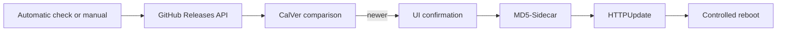

# OTA – Firmware Updates

Chaya2MQTT supports **over-the-air updates** through GitHub Releases. The firmware is downloaded via HTTPS, checked with MD5 for transmission errors, and flashed to the next OTA partition using Arduino `HTTPUpdate`.

## Overview



## Channels

| Channel | Source | Selection |
|---------|--------|-----------|
| `stable` | `/repos/.../releases/latest` | Latest non-draft release |
| `beta` | `/repos/.../releases?per_page=10` | Latest prerelease, otherwise fallback to stable |

The channel selection is stored in NVS (`cfg/upd_chan`). Automatic downgrades are not performed.

## GitHub release source

| Parameter | Value |
|-----------|-------|
| Repository | `EyJunge1/chaya2mqtt` |
| Firmware-URL | `https://github.com/EyJunge1/chaya2mqtt/releases/download/{tag}/firmware.bin` |
| MD5-URL | `https://github.com/EyJunge1/chaya2mqtt/releases/download/{tag}/firmware.md5` |

Releases are triggered **manually** by a Git tag (CI: `.github/workflows/build-release.yml`). The tag must point to a commit contained in `main`.

## Versioning (CalVer)

Schema: **`YYYY.M.PATCH`** (month without a leading zero). Git tags have a `v` prefix.

| Type | Git tag | `APP_VERSION` in the firmware |
|------|---------|-------------------------------|
| Stable | `v2026.8.1` | `2026.8.1` |
| Release Candidate | `v2026.8.1-rc.1` | `2026.8.1-rc.1` |

RC releases are published on GitHub as **prereleases** and are not marked “Latest.” The stable channel therefore does not see them; the beta channel prefers them.

### Creating and pushing a tag

```bash
# Release candidate (from main)
git checkout main
git pull --no-tags origin main
git tag -a v2026.8.1-rc.1 -m "RC 2026.8.1-rc.1"
git push origin v2026.8.1-rc.1

# Stable (from main)
git tag -a v2026.8.1 -m "Release 2026.8.1"
git push origin v2026.8.1
```

Before tagging, run locally: `make check`.

## Version comparison

- `APP_VERSION` from `config/version.h` (CI sets it from the tag **without** the leading `v`, e.g. `2026.8.1`)
- GitHub `tag_name` is compared component by component as CalVer (`YYYY`, month, patch, RC number); stable sorts above RC with the same base version
- An upgrade is available if the remote version > local version
- `APP_VERSION == "dev"`: **no automatic check** (manual only)

## Automatic check (daily)

| Condition | Description |
|-----------|-------------|
| Mode | STA mode only (not AP) |
| WiFi | STA connected |
| NTP | Time synchronized (`> 1700000000` UTC) |
| Version | `APP_VERSION != "dev"` |
| Interval | At most once per UTC calendar day |
| NVS key | `cfg/upd_day` (last check day) |

Sequence:
1. Check the calendar day → if already checked: skip
2. `otaGithubEvaluateChannel()` → CalVer comparison for the selected channel
3. On upgrade: set status to `available` (**no** automatic installation)
4. Store the check day in NVS

## Manual check / installation

| Endpoint | Method | Description |
|----------|--------|-------------|
| `/api/update/status` | GET | Status snapshot |
| `/api/update/check` | POST | Start check; optional `channel=stable\|beta` |
| `/api/update/install` | POST | Start installation after confirmation |

The `ota` SSE event provides live updates (phase, progress, error).

Web UI: `/update`—channel selection, version display, progress, and a confirmation dialog before installation.

## Download & installation

`otaFlashVerifiedInstall(binUrl, md5Url)` in `ota/flash.cpp`:

1. **Load MD5 file:** `firmware.md5` via HTTPS + TLS (CA bundle)
2. **HTTPUpdate:** `setMD5sum()`, redirects enabled, `rebootOnUpdate(false)`
3. **Flash:** Arduino `HTTPUpdate`/`Update` writes to the next OTA partition
4. **Progress:** callbacks update the OTA status for SSE/UI
5. **Reboot:** controlled by chaya2mqtt after flushing

On an MD5 mismatch or flash error: **no reboot**.

## OTA task

| Parameter | Value |
|-----------|-------|
| Stack | 8192 bytes |
| Priority | 4 |
| Core | 1 |
| WDT | Registered (temporarily unregistered during `otaLoop()`) |

Before rebooting after a successful flash:
- `flushHeartCounterIfDirty()` / `flushHeartSentCounterIfDirty()`
- `releaseGpioHoldBeforeRestart()`
- `ESP.restart()`

## Boot after OTA

In the **app task** (`appTaskFn`), rollback is canceled only after a **stable runtime window**:

- Helper: `otaHealthWindowElapsed()` in `src/ota/ota_health.h`
- Default: **`kOtaHealthStableMs = 30000`** (30 s) after the first WiFi boot settlement (`wlanBootSettledAtMs()`)
- Requirements: `wlanIsSetupComplete()` and `wlanIsBootWifiSettled()` (STA **or** AP fallback)
- MQTT availability is **not** required (broker/router are external sources of failure)
- Then `otaTryMarkValidAfterHealthCheck()` marks the image as valid and cancels rollback

Pure helper tests: `test/test_ota/test_ota.cpp` (`test_ota_health_window`, including wraparound).

## CI/CD pipeline

GitHub Actions (`.github/workflows/build-release.yml`):

1. Trigger: push of tag `vYYYY.M.PATCH` or `vYYYY.M.PATCH-rc.N`
2. Validate tag format; commit must be an ancestor of `origin/main`
3. Set `APP_VERSION` from the tag (without `v`)
4. Build frontend + embed SPA (lint/tests run locally only via `make check`)
5. Run `pio run -e esp32dev-release` and verify OTA slot size
6. Calculate MD5 of `firmware.bin`
7. GitHub Release with `firmware.bin` + `firmware.md5` (RC = prerelease)

Local checks before commits: `make check` (Cursor rule: `.cursor/rules/check-before-commit.mdc`).

## Error handling

| Error | Behavior |
|-------|----------|
| GitHub API unavailable | Status `error` / `api_error`, no download |
| No upgrade available | Status `idle`, still store the check day |
| MD5 mismatch | Abort installation, no reboot |
| Flash error | Abort installation, no reboot |
| AP mode | Automatic check skipped |

## Security

- TLS with the Mozilla CA bundle for downloads
- MD5 integrity check against transmission errors (not cryptographic proof of origin)
- **No code signature** for firmware blobs
- Threat model: trust in the GitHub release source
- During OTA, factory reset / reboot / network restart are blocked (`otaBlocksDestructiveAction`)

## USB recovery & core dumps

### Device no longer reachable (“brick”)

1. Connect USB
2. `pio run -e esp32dev-release -t erase` (optional; deletes NVS including WiFi)
3. `make upload ENV=esp32dev-release`
4. The open `Chaya2MQTT` SoftAP appears without credentials; the display shows the SSID and setup URL/IP

There is **no** unauthenticated HTTP endpoint for core dumps.

### Reading a core dump

The `coredump` partition (64 KiB @ `0x3D0000` in `huge_app.csv`):

```bash
# Read dump from flash (adjust port)
esptool.py --chip esp32 --port /dev/tty.usbserial-* read_flash 0x3D0000 0x10000 /tmp/coredump.bin

# Analyze against the matching ELF
pio run -e esp32dev-release   # creates .pio/build/esp32dev-release/firmware.elf
python3 scripts/analyze_coredump.py /tmp/coredump.bin esp32dev-release
```

## Further documentation

- Configuration (NVS `upd_day`, `upd_chan`): [CONFIGURATION.md](CONFIGURATION.md)
- Architecture (OTA task): [ARCHITECTURE.md](ARCHITECTURE.md)
- Hardware / brick recovery: [HARDWARE.md](HARDWARE.md)
