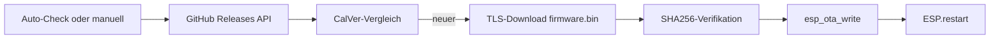

# OTA – Firmware-Updates

Chaya2MQTT unterstützt **Over-The-Air-Updates** über GitHub Releases. Die Firmware wird per HTTPS heruntergeladen, SHA256-verifiziert und in die nächste OTA-Partition geflasht.

## Übersicht



## GitHub-Release-Quelle

| Parameter | Wert |
|-----------|------|
| Repository | `EyJunge1/chaya2mqtt` |
| API-URL | `https://api.github.com/repos/EyJunge1/chaya2mqtt/releases/latest` |
| Firmware-URL | `https://github.com/EyJunge1/chaya2mqtt/releases/latest/download/firmware.bin` |
| SHA256-URL | `{firmware-url}.sha256` |

Releases werden **manuell** per Git-Tag ausgelöst (CI: `.github/workflows/build-release.yml`). Der Tag muss auf einem Commit liegen, der in `main` enthalten ist.

## Versionierung (CalVer)

Schema: **`YYYY.M.PATCH`** (Monat ohne führende Null). Git-Tags tragen ein Prefixt `v`.

| Art | Git-Tag | `APP_VERSION` in der Firmware |
|-----|---------|-------------------------------|
| Stable | `v2026.8.1` | `2026.8.1` |
| Release Candidate | `v2026.8.1-rc.1` | `2026.8.1-rc.1` |

RC-Releases werden auf GitHub als **Prerelease** veröffentlicht und nicht als „Latest“ markiert. OTA nutzt `releases/latest` und sieht deshalb nur Stable-Releases.

### Tag erstellen und pushen

```bash
# Release Candidate (aus main)
git checkout main
git pull --no-tags origin main
git tag -a v2026.8.1-rc.1 -m "RC 2026.8.1-rc.1"
git push origin v2026.8.1-rc.1

# Stable (aus main)
git tag -a v2026.8.1 -m "Release 2026.8.1"
git push origin v2026.8.1
```

Vor dem Tag lokal prüfen: `make check`.

## Versionsvergleich

- `APP_VERSION` aus `config/version.h` (CI setzt aus Tag **ohne** führendes `v`, z. B. `2026.8.1`)
- GitHub `tag_name` wird als CalVer geparst (`YYYY * 10⁵ + M * 10³ + PATCH`, Stable sortiert über RC mit gleicher Basis)
- Upgrade verfügbar wenn Remote-Version > lokale Version
- `APP_VERSION == "dev"`: **kein automatischer Check** (nur manuell)

## Auto-Check (täglich)

| Bedingung | Beschreibung |
|-----------|--------------|
| Modus | Nur im STA-Modus (nicht AP) |
| WiFi | STA verbunden |
| NTP | Zeit synchronisiert (`> 1700000000` UTC) |
| Version | `APP_VERSION != "dev"` |
| Intervall | Max. 1× pro UTC-Kalendertag |
| NVS-Key | `cfg/upd_day` (letzter Check-Tag) |

Ablauf in `otaLoop()` (OTA-Task, alle 100 ms):
1. Kalendertag prüfen → wenn schon gecheckt: skip
2. `otaGithubEvaluateLatestRelease()` → CalVer-Vergleich
3. Bei Upgrade: URL merken, Download queueen
4. Check-Tag in NVS speichern

## Manueller Check

- Web-UI: POST `/update-check` → `otaQueueGithubCheck()`
- Setzt `g_otaCheckRequested` → wird im nächsten `otaLoop()`-Zyklus verarbeitet
- Auch ohne NTP möglich (Warnung im Log)

## Download & Installation

`otaFlashVerifiedInstall(url)` in `ota/flash.cpp`:

1. **SHA256-Datei laden:** `{url}.sha256` per HTTPS + TLS (CA-Bundle)
2. **Firmware laden:** `firmware.bin` per HTTPS, Streaming in 4096-Byte-Chunks
3. **SHA256 berechnen:** Mbedtls SHA256 über den gesamten Download
4. **Vergleich:** Berechneter Hash vs. erwarteter Hash
5. **Flash:** `esp_ota_begin()` → `esp_ota_write()` → `esp_ota_end()`
6. **Partition:** Nächste OTA-Partition (`ota_0` ↔ `ota_1`)

Bei Hash-Mismatch: Download abbrechen, **kein Reboot**.

## OTA-Task

| Parameter | Wert |
|-----------|------|
| Stack | 8192 Bytes |
| Priorität | 4 |
| Core | 1 |
| WDT | angemeldet (temporär abgemeldet während `otaLoop()`) |

Vor Reboot nach erfolgreichem Flash:
- `flushHeartCounterIfDirty()` / `flushHeartSentCounterIfDirty()`
- `releaseGpioHoldBeforeRestart()`
- `ESP.restart()`

## Boot nach OTA

Im **App-Task** (`appTaskFn`), nach den initialen Health-Check-Schleifen:
- `otaTryMarkValidAfterHealthCheck()` markiert das Image als gültig
- Bricht Rollback ab, sobald Netzwerk und MQTT stabil laufen (verzögerter Health-Check statt direktem Markieren in `setup()`)

## CI/CD Pipeline

GitHub Actions (`.github/workflows/build-release.yml`):

1. Trigger: Push auf Tag `vYYYY.M.PATCH` oder `vYYYY.M.PATCH-rc.N`
2. Tag-Format prüfen; Commit muss Ancestor von `origin/main` sein
3. `APP_VERSION` aus Tag setzen (ohne `v`)
4. Frontend build + SPA einbetten (Lint/Tests nur lokal via `make check`)
5. `pio run -e esp32dev-release`, OTA-Slot-Größe prüfen
6. SHA256 von `firmware.bin` berechnen
7. GitHub Release mit `firmware.bin` + `firmware.sha256` (RC = Prerelease)

Lokale Checks vor Commits: `make check` (Cursor-Regel: `.cursor/rules/check-before-commit.mdc`).

## Fehlerbehandlung

| Fehler | Verhalten |
|--------|-----------|
| GitHub API nicht erreichbar | Log-Warnung, kein Download |
| Kein Upgrade verfügbar | Check-Tag trotzdem speichern |
| SHA256-Mismatch | Download abbrechen, kein Reboot |
| Flash-Fehler | `esp_ota_abort()`, kein Reboot |
| AP-Modus | Auto-Check übersprungen |

## Sicherheit

- TLS mit Mozilla-CA-Bundle für Download
- SHA256-Integritätsprüfung
- **Keine Code-Signatur** der Firmware-Blobs
- Threat Model: Vertrauen in GitHub-Release-Quelle

Details: [SECURITY.md](SECURITY.md)

## Weitere Dokumentation

- Konfiguration (NVS `upd_day`): [CONFIGURATION.md](CONFIGURATION.md)
- Architektur (OTA-Task): [ARCHITECTURE.md](ARCHITECTURE.md)
