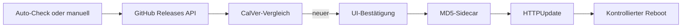

# OTA – Firmware-Updates

Chaya2MQTT unterstützt **Over-The-Air-Updates** über GitHub Releases. Die Firmware wird per HTTPS heruntergeladen, mit MD5 gegen Übertragungsfehler geprüft und über Arduino-`HTTPUpdate` in die nächste OTA-Partition geflasht.

## Übersicht



## Kanäle

| Kanal | Quelle | Auswahl |
|-------|--------|---------|
| `stable` | `/repos/.../releases/latest` | Neuestes nicht-Draft-Release |
| `beta` | `/repos/.../releases?per_page=10` | Neuestes Prerelease, sonst Fallback auf Stable |

Kanalwahl wird in NVS (`cfg/upd_chan`) gespeichert. Ein automatisches Downgrade findet nicht statt.

## GitHub-Release-Quelle

| Parameter | Wert |
|-----------|------|
| Repository | `EyJunge1/chaya2mqtt` |
| Firmware-URL | `https://github.com/EyJunge1/chaya2mqtt/releases/download/{tag}/firmware.bin` |
| MD5-URL | `https://github.com/EyJunge1/chaya2mqtt/releases/download/{tag}/firmware.md5` |

Releases werden **manuell** per Git-Tag ausgelöst (CI: `.github/workflows/build-release.yml`). Der Tag muss auf einem Commit liegen, der in `main` enthalten ist.

## Versionierung (CalVer)

Schema: **`YYYY.M.PATCH`** (Monat ohne führende Null). Git-Tags tragen ein Prefixt `v`.

| Art | Git-Tag | `APP_VERSION` in der Firmware |
|-----|---------|-------------------------------|
| Stable | `v2026.8.1` | `2026.8.1` |
| Release Candidate | `v2026.8.1-rc.1` | `2026.8.1-rc.1` |

RC-Releases werden auf GitHub als **Prerelease** veröffentlicht und nicht als „Latest“ markiert. Der Stable-Kanal sieht sie deshalb nicht; der Beta-Kanal bevorzugt sie.

### Tag erstellen und pushen

```bash
# Release Candidate (aus main)
git checkout main
git pull --no-tags origin main
git tag -a v2026.8.1-rc.1 -m "RC 2026.8.1-rc.1"
git push origin v2026.8.1-rc.1

# Stable (aus main)
git tag -a v2026.8.1 -m "Release 2026.8.1"
git push origin v2026.8.1
```

Vor dem Tag lokal prüfen: `make check`.

## Versionsvergleich

- `APP_VERSION` aus `config/version.h` (CI setzt aus Tag **ohne** führendes `v`, z. B. `2026.8.1`)
- GitHub `tag_name` wird als CalVer geparst (`(YYYY * 10⁵ + M * 10³ + PATCH) * 1000 + rcComponent`; Stable = 999, `-rc.N` = N)
- Upgrade verfügbar wenn Remote-Version > lokale Version
- `APP_VERSION == "dev"`: **kein automatischer Check** (nur manuell)

## Auto-Check (täglich)

| Bedingung | Beschreibung |
|-----------|--------------|
| Modus | Nur im STA-Modus (nicht AP) |
| WiFi | STA verbunden |
| NTP | Zeit synchronisiert (`> 1700000000` UTC) |
| Version | `APP_VERSION != "dev"` |
| Intervall | Max. 1× pro UTC-Kalendertag |
| NVS-Key | `cfg/upd_day` (letzter Check-Tag) |

Ablauf:
1. Kalendertag prüfen → wenn schon gecheckt: skip
2. `otaGithubEvaluateChannel()` → CalVer-Vergleich für den gewählten Kanal
3. Bei Upgrade: Status `available` setzen (**keine** automatische Installation)
4. Check-Tag in NVS speichern

## Manueller Check / Installation

| Endpoint | Methode | Beschreibung |
|----------|---------|--------------|
| `/api/update/status` | GET | Status-Snapshot |
| `/api/update/check` | POST | Check starten; optional `channel=stable\|beta` |
| `/api/update/install` | POST | Installation nach Bestätigung starten |

SSE-Event `ota` liefert Live-Updates (Phase, Fortschritt, Fehler).

Web-UI: `/update` — Kanalwahl, Versionsanzeige, Fortschritt, Confirm-Dialog vor Install.

## Download & Installation

`otaFlashVerifiedInstall(binUrl, md5Url)` in `ota/flash.cpp`:

1. **MD5-Datei laden:** `firmware.md5` per HTTPS + TLS (CA-Bundle)
2. **HTTPUpdate:** `setMD5sum()`, Redirects an, `rebootOnUpdate(false)`
3. **Flash:** Arduino-`HTTPUpdate`/`Update` schreibt in die nächste OTA-Partition
4. **Fortschritt:** Callbacks aktualisieren den OTA-Status für SSE/UI
5. **Reboot:** kontrolliert durch chaya2mqtt nach Flush

Bei MD5-Mismatch oder Flash-Fehler: **kein Reboot**.

## OTA-Task

| Parameter | Wert |
|-----------|------|
| Stack | 8192 Bytes |
| Priorität | 4 |
| Core | 1 |
| WDT | angemeldet (temporär abgemeldet während `otaLoop()`) |

Vor Reboot nach erfolgreichem Flash:
- `flushHeartCounterIfDirty()` / `flushHeartSentCounterIfDirty()`
- `releaseGpioHoldBeforeRestart()`
- `ESP.restart()`

## Boot nach OTA

Im **App-Task** (`appTaskFn`), nach den initialen Health-Check-Schleifen:
- `otaTryMarkValidAfterHealthCheck()` markiert das Image als gültig
- Bricht Rollback ab, sobald WiFi-Setup abgeschlossen und Boot-WiFi settled ist

## CI/CD Pipeline

GitHub Actions (`.github/workflows/build-release.yml`):

1. Trigger: Push auf Tag `vYYYY.M.PATCH` oder `vYYYY.M.PATCH-rc.N`
2. Tag-Format prüfen; Commit muss Ancestor von `origin/main` sein
3. `APP_VERSION` aus Tag setzen (ohne `v`)
4. Frontend build + SPA einbetten (Lint/Tests nur lokal via `make check`)
5. `pio run -e esp32dev-release`, OTA-Slot-Größe prüfen
6. MD5 von `firmware.bin` berechnen
7. GitHub Release mit `firmware.bin` + `firmware.md5` (RC = Prerelease)

Lokale Checks vor Commits: `make check` (Cursor-Regel: `.cursor/rules/check-before-commit.mdc`).

## Fehlerbehandlung

| Fehler | Verhalten |
|--------|-----------|
| GitHub API nicht erreichbar | Status `error` / `api_error`, kein Download |
| Kein Upgrade verfügbar | Status `idle`, Check-Tag trotzdem speichern |
| MD5-Mismatch | Installation abbrechen, kein Reboot |
| Flash-Fehler | Installation abbrechen, kein Reboot |
| AP-Modus | Auto-Check übersprungen |

## Sicherheit

- TLS mit Mozilla-CA-Bundle für Download
- MD5-Integritätsprüfung gegen Übertragungsfehler (kein kryptografischer Herkunftsnachweis)
- **Keine Code-Signatur** der Firmware-Blobs
- Threat Model: Vertrauen in GitHub-Release-Quelle

Details: [SECURITY.md](SECURITY.md)

## Weitere Dokumentation

- Konfiguration (NVS `upd_day`, `upd_chan`): [CONFIGURATION.md](CONFIGURATION.md)
- Architektur (OTA-Task): [ARCHITECTURE.md](ARCHITECTURE.md)
