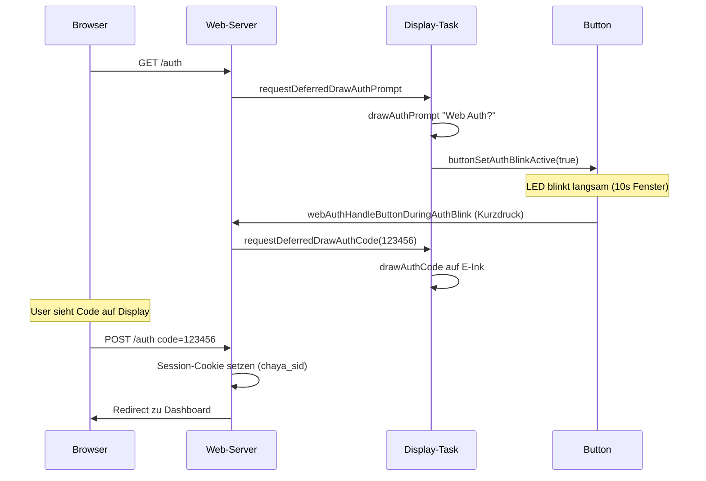

# Web-Administration

Die Weboberfläche läuft auf **Port 80** (HTTP) über `ESPAsyncWebServer`. Im AP-Modus (Ersteinrichtung) sind die meisten Routen ohne Authentifizierung erreichbar; im STA-Modus kann optional **Web-Auth** aktiviert werden.

## Zugriff

| Modus | URL | Auth |
|-------|-----|------|
| AP (Setup) | Captive Portal / `http://4.3.2.1` | Offen (WiFi-Routen) |
| STA | `http://chaya2mqtt.local` (mDNS) | Optional (Settings) |

Hostname: `chaya2mqtt` (Konstante `kDeviceHostname`).

## HTTP-Routen

### Dashboard & Anwendung

| Route | Methode | Auth (STA) | Beschreibung |
|-------|---------|------------|--------------|
| `/` | GET | Session | Dashboard mit RX/TX-Zähler, MQTT/WiFi-Status |
| `/chaya-status` | GET | Session | JSON: `{rx, tx, connected}` |
| `/chaya-send` | GET | Session | MQTT-Senden (queued als `NetCmd::ChayaSendRequested`) |
| `/settings` | GET | Session | Reset-Periode, Web-Auth an/aus |
| `/settings` | POST | Session + CSRF | Einstellungen speichern (deferred) |
| `/update` | GET | Session | OTA-Update-Seite |
| `/update-check` | POST | Session + CSRF | Manuellen GitHub-Check anstoßen |
| `/reboot` | POST | Session + CSRF | Neustart (deferred) |

### WiFi

| Route | Methode | Auth | Beschreibung |
|-------|---------|------|--------------|
| `/wifi` | GET | Offen (AP) / Session (STA) | WLAN-Formular |
| `/wifi-scan` | GET | Offen / Session | JSON: Scan-Ergebnisse (max. 40 APs) |
| `/wifi-status` | GET | Offen / Session | JSON: Link-Status |
| `/wifi-connect` | POST | Offen / Session + CSRF | Credentials speichern / AP-Test starten |
| `/wifi-testing` | GET | AP | Test-Fortschritts-Seite |
| `/wifi-connect-status` | GET | AP | JSON: Test-State |
| `/wifi-connect-commit` | POST | AP + CSRF | Test OK → NVS + Reboot |
| `/wifi-connect-abort` | POST | AP + CSRF | Test abbrechen |

### MQTT & Pairing

| Route | Methode | Auth | Beschreibung |
|-------|---------|------|--------------|
| `/mqtt` | GET | Session | Broker/Topics konfigurieren |
| `/mqtt` | POST | Session + CSRF | MQTT speichern (deferred → Network-Task) |
| `/mqtt-status` | GET | Session | JSON: `{connected}` |
| `/pairing` | GET | Session | Device-ID + QR-Code, Partner-Eingabe |
| `/pairing` | POST | Session + CSRF | Partner-ID speichern → Auto-Topics |

### Authentifizierung

| Route | Methode | Auth | Beschreibung |
|-------|---------|------|--------------|
| `/auth` | GET | Offen | Login-Seite (Challenge starten) |
| `/auth` | POST | Offen + CSRF | 6-stelligen Code eingeben |
| `/logout` | POST | Session + CSRF | Session beenden |

### Live-Events

| Route | Methode | Auth | Beschreibung |
|-------|---------|------|--------------|
| `/events` | SSE | Offen (AP) / Session | Server-Sent Events |

## Server-Sent Events (SSE)

Endpoint `/events` liefert Live-Updates für das Dashboard:

| Event-Typ | Payload (JSON) | Inhalt |
|-----------|----------------|--------|
| `chaya` | `{rx, tx, connected}` | Zähler-Deltas + MQTT-Verbindung |
| `wifi` | `{connected, ssid?, ip?, rssi?}` | WLAN-Link-Status |
| `mqtt` | `{connected}` | MQTT-Verbindungsstatus |

Clients verbinden sich per `EventSource('/events')`. Der App-Task tickt `webEventsTick()` alle 500 ms und sendet nur bei Änderungen.

WiFi-RSSI wird alle 4 Ticks neu gelesen (Performance-Optimierung).

## Web-Auth-Flow

Web-Auth ist optional und wird unter **Settings** aktiviert (`cfg/authEn`). Im AP-Modus ist Auth immer deaktiviert.

### Ablauf

### Zeitfenster

| Phase | Dauer | Beschreibung |
|-------|-------|--------------|
| Tastenbestätigung | **10 s** | Nach „Web Auth?" auf Display – physischer Kurzdruck nötig |
| Code-Eingabe | **5 min** | 6-stelliger Code auf E-Ink, Eingabe im Browser |
| Session | **24 h** | Cookie `chaya_sid` |
| Lockout | **1 h** | Nach 3 Fehlversuchen |

### Sicherheitsmerkmale

- **Physischer Tastendruck** erforderlich, bevor der Code generiert wird (Schutz vor Remote-Auth ohne Gerätezugriff)
- **CSRF-Token** in allen POST-Formularen
- Session-Cookie mit `HttpOnly`, `SameSite=Strict`
- Lockout nach wiederholten Fehlversuchen

### Öffentliche Pfade (ohne Session)

**Im AP-Modus:**
- `/`, `/wifi`, `/wifi-scan`, `/wifi-status`, `/wifi-connect*`, `/favicon.ico`

**Im STA-Modus (Auth aktiv):**
- `/wifi`, `/wifi-scan`, `/wifi-status`, `/wifi-connect*`, `/auth`, `/logout`

## CSRF-Schutz

Jedes POST-Formular enthält ein `csrf_token`-Feld. Der Token wird bei `webAuthInit()` generiert und über `webAuthValidateCsrfPost()` geprüft. Ungültige Tokens werden abgelehnt.

## Deferred Work Pattern

HTTP-Handler führen keine blockierenden Operationen aus:

| Aktion | Mechanismus | Verarbeitung |
|--------|-------------|--------------|
| MQTT speichern | `g_webAdminMqttApplyPending` | App-Task → `NetCmd::MqttSettingsChanged` |
| Settings speichern | `g_webAdminSettingsApplyPending` | App-Task → NVS write |
| Reboot | `g_webAdminRebootRequested` | App-Task → `ESP.restart()` |
| WiFi-Reconnect | `g_webAdminWifiReconnectRequested` | App-Task → Reboot |
| OTA-Check | `otaQueueGithubCheck()` | OTA-Task |

Vor Reboot werden Zähler geflusht (`flushHeartCounterIfDirty()`).

## Eingebettete Assets

CSS und JavaScript liegen als PROGMEM-Header unter `src/web/assets/`:

| Datei | Inhalt |
|-------|--------|
| `styles.h` | Gemeinsames CSS |
| `common_js.h` | Shared JS |
| `wifi_scan_js.h` | WiFi-Scan-UI |
| `wifi_status_js.h` | WiFi-Status + SSE |
| `wifi_connect_test_js.h` | AP-Verbindungstest |
| `mqtt_status_js.h` | MQTT-Status + SSE |
| `chaya_js.h` | Dashboard-Zähler + Send + SSE |
| `pairing_js.h` | Pairing-QR-Code |

HTML wird per Streaming aus `pages.cpp` generiert.

## WiFi-Verbindungstest (AP-Modus)

Im Setup-AP wird die WLAN-Verbindung **vor dem Speichern getestet**:

1. User gibt SSID/Passwort ein → POST `/wifi-connect`
2. Redirect zu `/wifi-testing` (Fortschrittsanzeige)
3. Gerät versucht STA-Verbindung im Hintergrund (`wifi/test.cpp`)
4. Polling über `/wifi-connect-status` (JSON)
5. Bei Erfolg: POST `/wifi-connect-commit` → NVS speichern + Reboot
6. Bei Abbruch: POST `/wifi-connect-abort`

Im STA-Modus werden Credentials direkt gespeichert und ein Reboot geplant.

## Weitere Dokumentation

- Architektur: [ARCHITECTURE.md](ARCHITECTURE.md)
- Konfiguration: [CONFIGURATION.md](CONFIGURATION.md)
- Sicherheit: [SECURITY.md](SECURITY.md)
